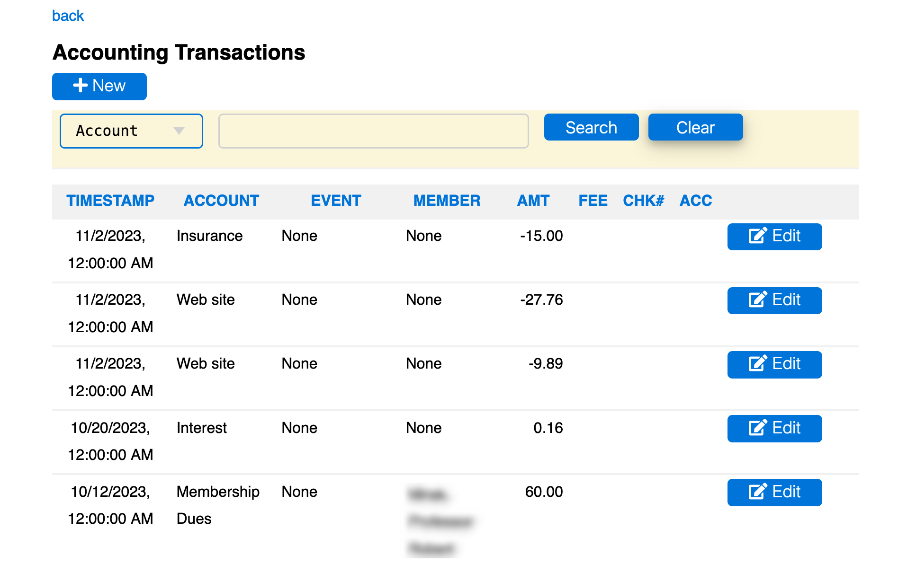

# [Oxford/Cambridge Alumni Group Database](index.md)

## Account Transactions Page

This page is reached from the link on a bank row in the [accounts page](accounts.md) (to display all transactions connected with the bank or payment processor), or through links in the Financial or Tax reports (to display related sets of transactions):

The back link returns to the previous context. Transactions are displayed in a grid in reverse chronological order. You can click on columns to sort by that column, or to reverse sort order, for example to look at the oldest transactions.

There is a search box at the top that allows transactions to be filtered, e.g. to specific accounts and/or events, or by searching the Notes field for name or email address.

Accrued entries that have not yet been reconciled are marked and are deleteable as well as editable. The Add Record button allows accrued entries to be created when writing a check and displaying the bank's transactions.

Reconciled entries are created by uploading transaction files obtained from the institution, which matches them up with accrued items in the case of check payments. These records cannot be deleted through this screen and only certain fields can be edited, typically to associate them with an event and assign an accounting category. The amount field can be edited to create a split transaction, where part of the transaction will be assigned to a different account and/or event. Any fee (on a Stripe charge) is split proportionally when a transaction is split.
