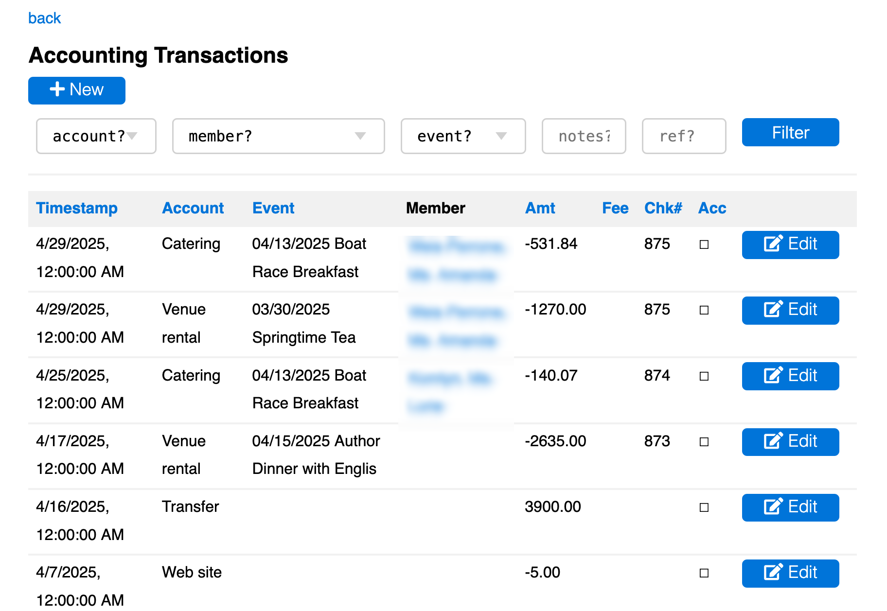

# [Oxford/Cambridge Alumni Group Database](index.md)

## Account Transactions Page

This page is reached from the link on a bank row in the [accounts page](accounts.md) (to display all transactions connected with the bank or payment processor), or through links in the Financial or Tax reports (to display related sets of transactions):

The back link returns to the previous context. Transactions are displayed in a grid in reverse chronological order. You can click on a column header to sort by the values in that column, and click again to reverse sort order. For example, sorting by check number can help locate missing check records; click the ACC(rued) heading twice to see undeposited but recorded checks at the top.

There is a search box at the top that allows transactions to be filtered, e.g. to specific accounts, members, and/or events, or by searching the Notes field for name or email address.

Accrued entries that have not yet been reconciled are marked and are deleteable as well as editable. The Add Record button allows accrued entries to be created when writing a check and displaying the bank's transactions.

Reconciled entries are created by uploading transaction files obtained from the institution, which matches them up with accrued items in the case of check payments, or with recorded charges in the case of membership dues or event registrations paid via Stripe.

In the case of incoming checks, when they are uploaded to the database after being deposited, they will initially be unallocated.

Editing an uploaded dues payment check by assigning to the 'membership dues' account and specifying the member automatically updates the member record status. Similarly, editing an event registration check by assigning it to the 'ticket sales' account and specifying both the member and the event updates the associated reservation record to reflect the payment.

Uploaded transactions can be split to assign portions of the amount to different accounts. To do this edit the transaction, specifying a split size and the associated account. A new transaction with the original characteristics and reduced amount will be created for the balance. Any fee is divided proportionally.
