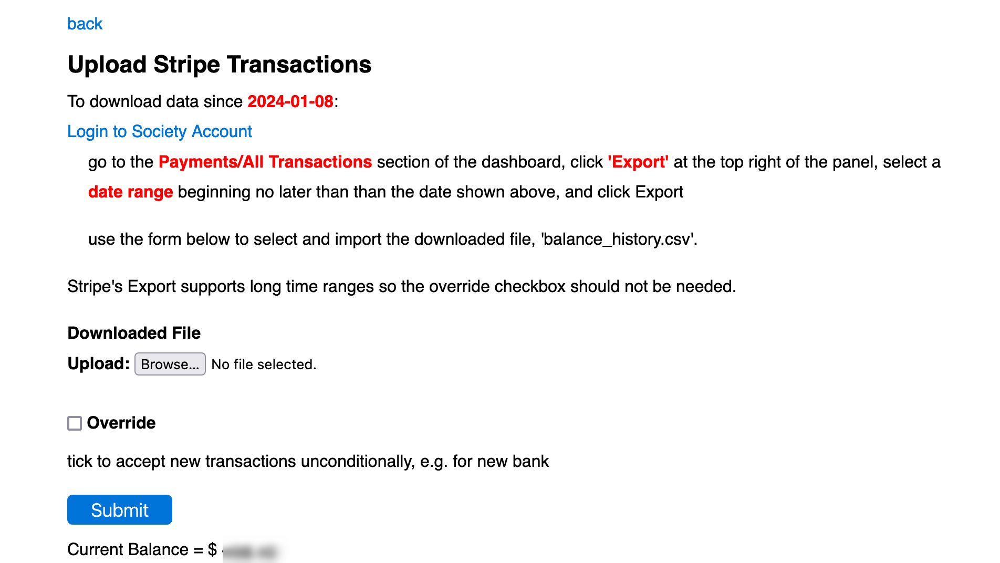

# [Oxford/Cambridge Alumni Group Application](index.md)

## Account Upload Page

Here is the Stripe account upload page:

The back link returns to the accounts screen. The content first describes how to download recent transactions from the institution, as recorded in the bank record. The date of the most recent record is shown as the downloaded file must include the data for this date to ensure that no transactions are missed.

Next is a browse button to select the downloaded results, and an override button which should never normally need to be used to override the requirement that the downloaded file overlap previously downloaded transactions.

Finally, the Submit performs the upload to the database; below it the current account balance is shown.

After submission, the [transactions](account_transactions.md) page will be shown, with a flash message indicating how many new transactions have been added, the resulting balance, whether any need to be manually allocated, and the new account balance.
