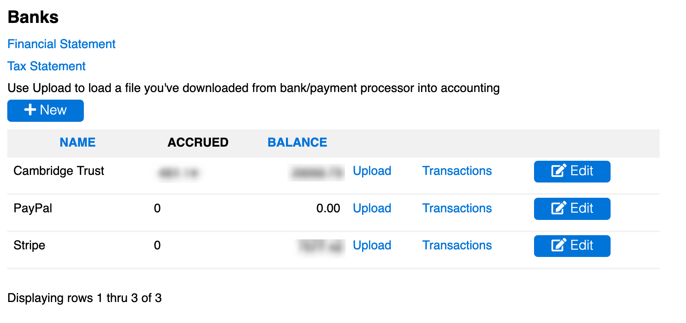

# [Oxford/Cambridge Alumni Group Database](index.md)

## Accounts Page

This page is reached from **Accounts** button on the blue navigation bar. It shows the financial
institutions (banks and payment processors) used by the Society:

The database maintains accounts by combining transactions data downloaded from the organization's bank (in the example Cambridge Trust) and payment processor (Stripe), and producing financial reports.

Supporting additional payment processors (such as PayPal) would require developing a Python module to implement the real-time interface to the processor's API. The example includes a row for PayPal to provide access to historical transactions.

Successful Stripe payments are recorded in real-time by marking the member record (membership dues) or event registration as charged. When the downloaded Stripe file is later processed, transactions are automatically reconciled with the affected member and event reservation records, recorded in accounting and assigned to the appropriate accounts.

PayPal is included because the database contains historical data of our PayPal usage from late 2011 through 2018. We then switched to Stripe as our payment processor. The current software does not support upload of data from PayPal. We use Stripe checkout which allows us to capture successful payments in real time in order to be able to issue confirmations accurately and immediately. Stripe also allows us to create auto-renewing subscriptions.

Alongside each institution is an **upload** link for uploading new information from the institution, a [**transactions**](account_transactions.md) link to view the corresponding transactions register, and an **Edit** button for viewing/editing the [**bank record**](bank_record.md). Above the list of institutions is a **+New** button for setting up a new institution, and a link to view transactions across both bank and payment processor.

The transactions list for the bank should be used to record checks when writing them. When they are later deposited the downloaded record from the bank will be automatically reconciled with the recorded accrual.

Incoming checks (e.g. when members insist on paying dues or event registrations by check) will be deposited online through the mobile bank app. After the check clears and is downloaded from the bank, the resulting transaction record will be 'unallocated'. Use the transactions list to assign the payment correctly.

Each institution's record includes a number of fields relating to the format of the download files received from the institution, as well as the user instructions for downloading these files that is displayed on the upload page. It is also where the current balance is held; it should normally not need to be manually adjusted. The bank record also includes (in a separate subtable) a list of **rules** allowing many transactions to be recognized and allocated to accounts automatically.

A non-zero figure in the Accrued column indicates checks have been manually recorded as they were written, but not yet deposited and downloaded from the bank.

The primary outputs of the module are the [**financial statement**](financial_statement.md) and the [**tax statement**](tax_statement.md) reached through the links at the top of the page.

A **chart of accounts** is used to establish accounting categories for each type of expense/revenue as well as asset classes (i.e. the banks and card processors). *Should new account categories need to be added, you can use the [db_tool](db_tool.md) or py4web dashboard to do so.*
