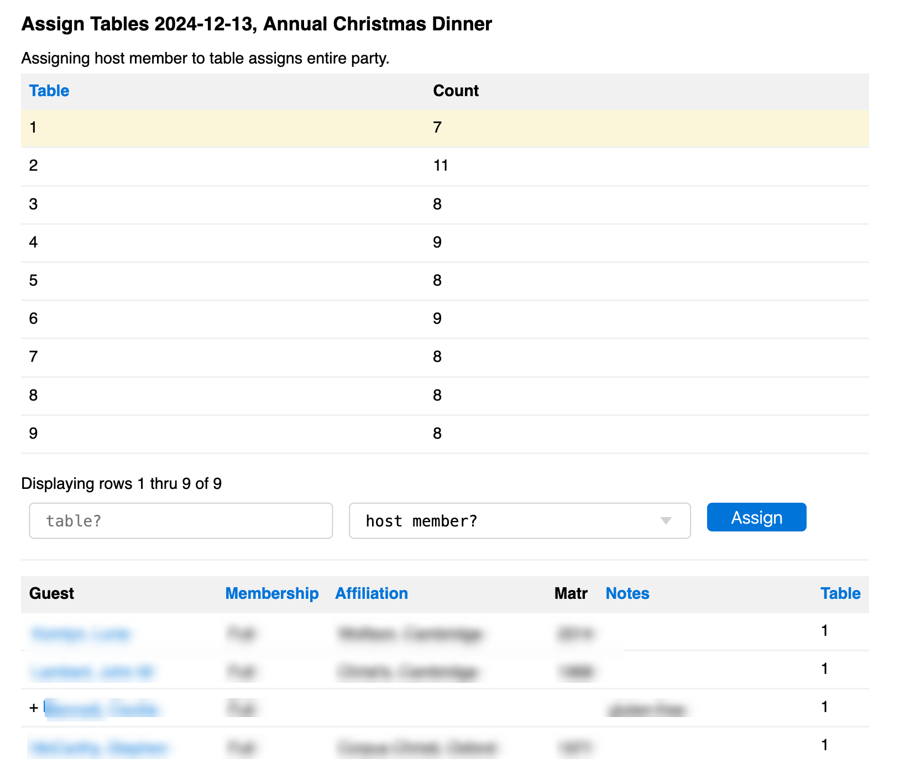

# [Oxford/Cambridge Alumni Group Application](index.md)

## Table Assignment Tool

This page is reached by clicking the "table assignment tool" link on an [event record](event_record.md).

It is designed for use prior to a formal event such as a dinner. The table assignments are included in the exported doorlist.csv file and can be used on name badges.

At the top of the page a summary is shown of the tables and seat counts already assigned.

This is followed by a form which allows a host member and their guests (a party) to be assigned to a named table by filling in the form and clicking 'Assign'

The grid below lists all registered confirmed guests. Guests not yet assigned a table appear at the top, followed by those in each table in party (host member) name order within tables. Guests are shown after their host member with a '+' prefix in front of their name.

Clicking on a guest name opens up the [event registration](event_registration.md). Editing the host member reservation Table will move the entire party, just like the tool; editing a guest reservation will move just the guest.
