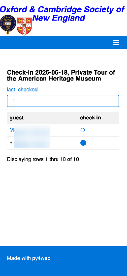

# [Oxford/Cambridge Alumni Group Application](index.md)

## Check-In Tool

This page is reached by clicking on an event name on the [Reservation List](reservation_list.md).

It is designed for use when checking in guests at the event, and so is designed to be smartphone friendly.

The list shows confirmed but not yet checked-in members with their guests (shown with '+ ' prefix) in member order. Tapping the tick at the right of the member checks in the entire party, which then disappears from the list.

The 'last checked' link is shown after a party has been checked in, and opens up the [details of that reservation](event_registration.md). Ticks in the status column indicate that the guests have been checked in. If one or more of the member's guests is going to check in separately, they can be edited to turn off the 'checked in' flag. The 'back' link will return to the check-in tool, and the guest will appear in the list together with a tick (normally guests don't show the tick-link).

To use the search field, start typing the last name of a member or guest. Usually two or three letters will be enough to find the desired reservation.
