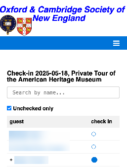

# [Oxford/Cambridge Alumni Group Application](index.md)

## Check-In Tool

This page is reached by clicking on an event name on the [Reservation List](reservation_list.md) and then clicking the "check-in tool" link.

It is designed for use when checking in guests at the event, and so is designed to be smartphone friendly.

The list starts by showing all reservations where at list one confirmed guest (either the host or one of their guests) has not yet checked in.

In the example, typing the initial 'M' in the search box has filtered the list down to a single reservation with containing a matching last name. The reservation includes the member (host) and one guest. The guest has been checked-in, as shown by the solid disc. Clicking on the empty disc will check-in the member and, as the reservation is now completely checked in, will clear the search box and display all remaining guests still to be checked-in. Note that clicking on a solid disc will clear the checked-in status of that guest.

The 'last checked' link is shown after a guest has been checked in, and opens up the [details of that reservation](event_registration.md), even if the reservation is fully checked-in. Ticks in the status column indicate that the guests have been checked in. The 'back' link will return to the check-in tool, and the guest will appear in the list together with a tick (normally guests don't show the tick-link).

To use the search field, start typing the last name of a member or guest. Usually two or three letters will be enough to find the desired reservation.
