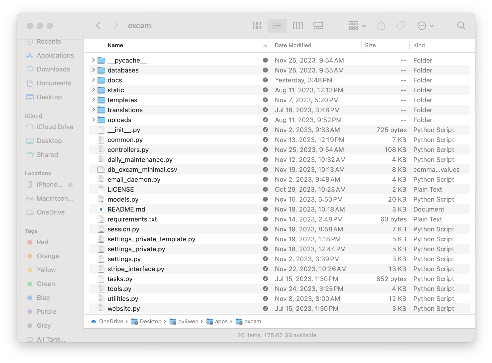

# [Oxford/Cambridge Alumni Group Database - Support Guide](support.md)

## OxCam App Contents

All the files which are part of the oxcam app are found in the subfolder py4web/apps/oxcam. The contents of the folder look like this:

The overall structure and some of the files are derived from the _scaffold app which is part of the py4web distribution.

There are hidden .git folder and .gitignore and .gitattributes files reflecting the fact that the app is cloned from a github repository.

The **databases** folder contains table description files, a sql.log file, and typically, the database itself (storage.db).

The **docs** folder contains both the user guide and support guide markdown files and in an images sub-folder png files.

The **static** folder contains css files and other static content. It also contains the favicon graphic, and, in the **images** subfolder,  the logo used in the letterhead and screen banner. Images to be added to email notices could also be placed in images.

**Templates** includes html templates used by the application. We use a small number of very generic templates to display, for example, forms and grids together with their surrounding header and footer material. layout.html controls the overall page layout for the database, including the menus. layout_embed.html controls the layout for the 'about' and 'past events' (history) pages which are embedded in the public website. The developer rarely needs to touch any of these files as all the logic around what to show on the page is in the controllers themselves.

I have not implemented any multi-language support so the **translations** folder is simply a copy of what is in the _scaffold application.

**\__init__**.py is the startup script. It differs from the one in _scaffold mainly in that I have put the controllers into multiple files, controllers.py, tools.py, session.py, stripe_interface.py and website.py.

**session.py** has the logic around login, email validation, and logout, and importantly the **@checkaccess** decorator which ensures users are logged in and controls access to administrative functions.

**controllers.py** has the logic for the all the pages that members use to join, renew, maintain email subscriptions, register for events, make payments etc. and for pages used by committee members for administrative purposes. Also the member directory pages.

**tools.py** provides some additional controllers useful for development and database management.

**website.py** contains the controllers for the 'about' and 'past events' pages of the main website.

**daily_maintenance.py** is the logic for the scheduled task which generates a database backup (in a .csv file) and generates renewal reminder messages where necessary for members such as student members that are not on auto-renew subscriptions. It also detects auto-renewal failures and accordingly cancels membership when necessary. Note that Stripe generates reminders to auto-renew members ahead of their renewal dates, as well as notices when credit cards need to be updated.

**email_daemon.py** is the logic that runs continously to send out email notices. These are not sent synchrounsly from the web-server as the process takes significant time for our long mailing list.

**models.py** defines our database schema.

**utilities.py** includes a selection of shared functions used by the (page) controllers.

**settings_private.py** contains Society specific definitions including such things as keys and passwords for email, Stripe, etc. Many of the settings vary, for example, between development and production instances. This file is not part of the repository, but is derived from the template **settings_private_template.py** which is included in the repo.
