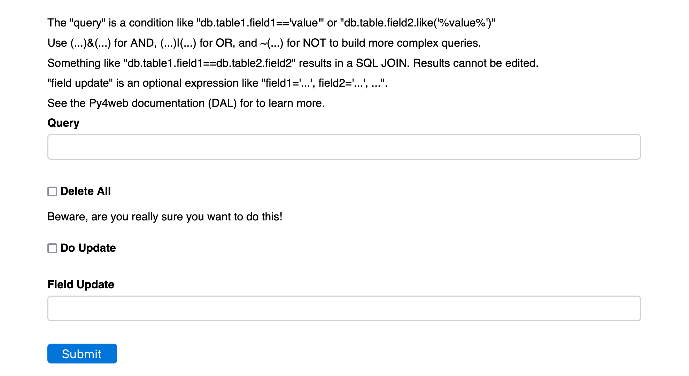
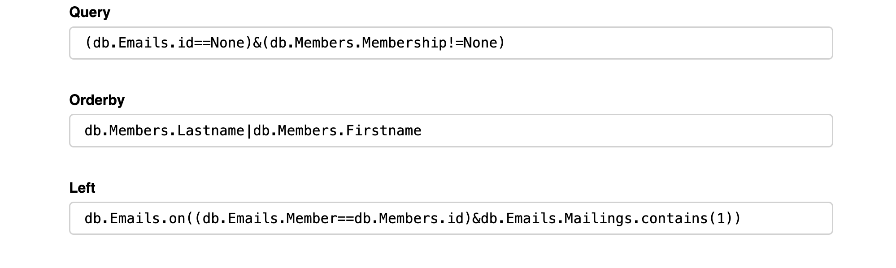

# [Oxford/Cambridge Alumni Group Database - Support Guide](support.md)

## db_tool

This is a powerful database management tool. It assumes the user is familiar with the database schema as defined in models.py and how to build queries. Refer to the [py4web DAL documentation](https://py4web.com/_documentation/static/en/chapter-07.html#) chapter.

To access the tool browse to \<your_py4web_url\>/oxcam/db_tool. You will see:



As the headings indicate, the query is as described in the [py4web documentation](https://py4web.com/_documentation/static/en/chapter-07.html#the-database-abstraction-layer-dal), as applied to the database schema defined in py4web/apps/oxcam/models.py. You can specify the display order in 'Orderby' and turn the query into a left join using 'Left'. See below for an example.

For example, we might want to list lapsed members by selecting those marked as members but with a paid date prior to some past date. The query might be:

`(db.Members.Membership!=None)&(db.Members.Paiddate<="2021-09-30")`

Submitting this query displays a grid of the results below the form. When, as in this case, the displayed records contain many fields, the results can be horizontally scrolled to view additional fields.

Individual records can be edited or deleted, and new records can be created using the +New button. When editing or creating records, the grid is replaced by a form with its own submit button.

Bulk updates are also possible. The example is pertinent as, from time to time, I modify lapsed members and clear their membership, in order to remove them from the online directory. The second part of the form allows this. Ticking the 'Do Update' box and entering parameters, e.g. in the example discussed:

`Membership=None`

and pressing Submit applies the bulk update. 'update_record' is used, as [documented here](https://py4web.com/_documentation/static/en/chapter-07.html#update-record). The grid will update (in the example it would now be empty).
A list of fields can be included, e.g. `Field1=value1, Field2=value2, ...`. The values can reference existing fields in the record, for example `Field1=db.Table.Field2+db.Table.Field3` (the value is a Python expression).

There is also a checkbox to do a bulk delete. **This is very dangerous.** Not only are the displayed records deleted, so are all records in other tables that reference them (cascading delete). So for example, in the Accounts module, if you delete an account from the Chart of Accounts (CoA table), all recorded transactions assigned to that account will be deleted (AccTrans table).

For a real world example of using a left join:



This example shows member records marked as members who have no subscriptions to the 'Member Events' mailing list (id==1). Note the order of the two query clauses, which is logically irrelevant but causes the selected member records to be displayed rather than a list of null Email records.

Note that in the update field you can use 'row' to refer to the current record contents. So for example:

```python
query:  db.Emails.Mailings.contains(2)
update: Mailings=row.Mailings.remove(2)
```

Might be used to remove all subscriptions to the mailing list with id==2.
