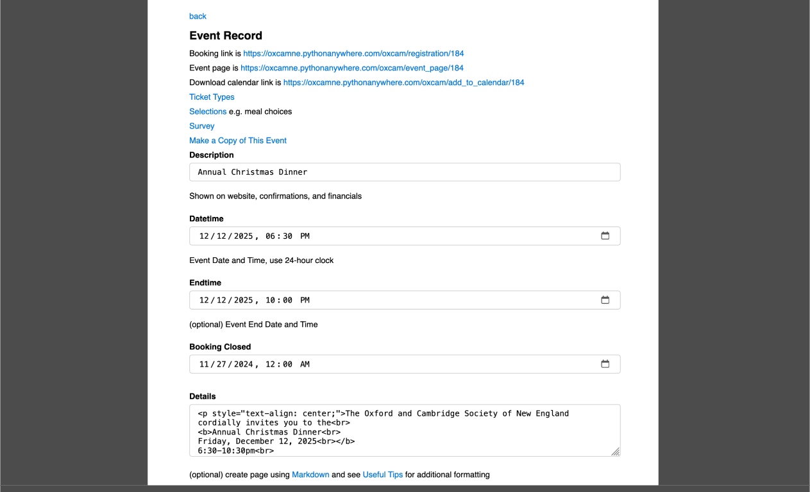

# [Oxford/Cambridge Alumni Group Application](index.md)

## Event Record

This page is reached through the Edit button on an event row of the [Events Page](events.md). At the top of the page:

The **back** link will take you back to the events page.

The booking link is the registration link which would be linked from the event page. This example is taken from the development environment and links to the local test environment.

Similarly, the event page link is shown; it may be external (on the group website, specified in the Page field of the record), or internal to the database (Details field of the event record).

The [**Ticket Types**](tickets.md), [**Selections**](selections.md), and [**Survey**](survey.md) links take you to the pages for managing ticket categories, menu selections, and multiple choice survey questions to appear on the registration and checkout pages. These data are all held in seperate records referencing the event record itself.

The **Make a Copy of This Event** link creates a new event record (and it's subrecords) initially identical except of a 'copy of ...' prefix added to the Event Description. The newly copied event is displayed so that it can be customized with the new date, etc.

Below the menu appear the fields of the main event record.

**Page** as noted above, this field can be used to point to an event page in an older website. It would normally be left blank. OxCamNE uses it in older events from before the database included web content.

**Description** contains the name of the event.

**Datetime** should contain the start date and time of the event. Once an event record is created with a future date/time it will appear in the home page calendar. The **Booking Closed** date/time defaults to the initial creation time of the event record so that it will be in the past and a newly created event will appear as a 'save the date'.

Registration is opened, and public access to the event details, by editing Booking Closed to reflect the end of the registration period. After that point until the event itself the registration link will allow users to place themselves on the **waitlist**.

**Details** is used to implement the event page within the database, and also automatically supplies content when the event notice is sent out to the mailing list. This avoids having to provide the information in two different contexts and formats. As with emails sent using the database, a combination of Markdown formatting and html can be used. Below the field the comment includes a link to [Markdown documentation](https://www.markdownguide.org/basic-syntax/); also [see here](send_email.md#useful-tips) for useful tips on managing graphic content, converting content from other formats, etc.

It is recommended that the registration link be represented as
> `[please register here]([[registration_link]])`

so that the link is computed dynamically. This means that if the event is cloned, e.g. for the next instance of an annual event, the registration link will be updated correctly.

Below this:

Ticking the **Members Only** checkbox restricts registration to members in good-standing at the time the event will take place. Full members with auto-renewing subscriptions will be assumed to be in good standing even if the event takes place after their currently paid date. Non-member alums and members whose renewal date precedes the event will need to join or renew at the time of registration.

Ticking the **Hidden** checkbox excludes the event from being shown in the Home page calendar and My Account page. This might be an event for the organizers only, or for our OxCam10 group. Only members sent the notice or link explicitly will be aware of the event.

Leaving Members Only unchecked allows any Oxbridge alumni to register. In this case, ticking **Allow Join** allows alumni to choose to join or renew as part of the registration process, as a convenience. For certain events, such as the Freshers' event, we do not allow join as registration includes the first year's membership.

If a number is placed in the **Guests** field it limits the total party size a member can register, including themself.

The **Sponsors** field allows us to open registration to other groups, e.g. for Burns Nicht. Potential sponsors are included in the Colleges table of the database as non-Oxbridge rows. Multiple Sponsor organizations can be enabled.

**Capacity** limits the total number of attendees, including members' guests. Once this limit is
breached, the **Waiting** flag is set so that future space allocations must be made manually
through the wait list. Below this:

The **Venue** and **Notes** fields appear on registration confirmations. Notes can be used to convey meeting points and other information without making them public.

**Comment** can contain an open ended question. This will be used at checkout to select free form response from registrants
