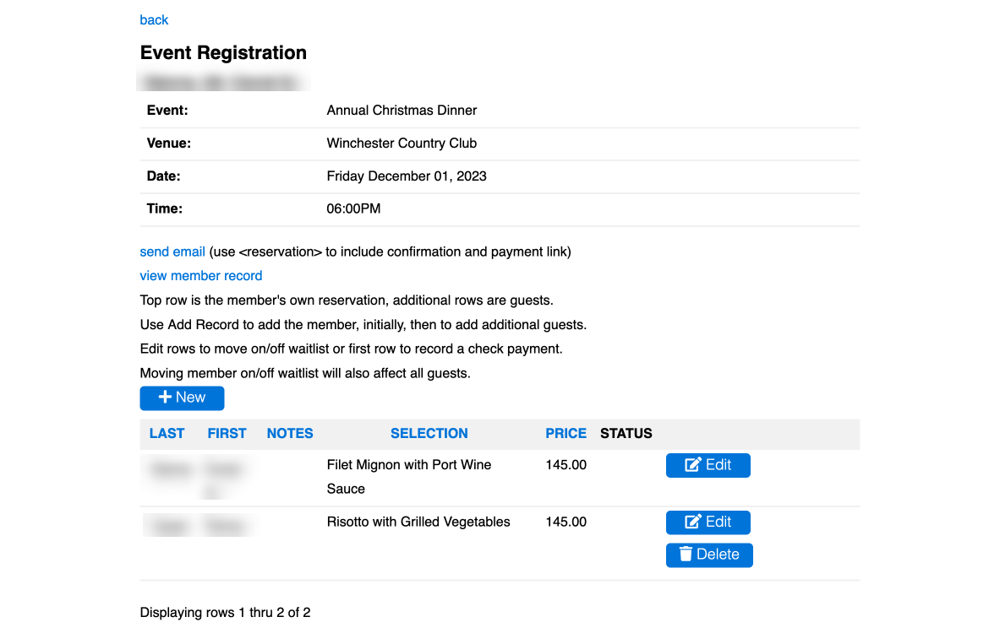

# [Oxford/Cambridge Alumni Group Application](index.md)

## Event Registration

This page displays the full information about a member's event registration including guests. It can be reached either through the [reservation list](reservation_list.md) or through the [member reservations](member_reservations.md) page:

The **back** link will take you back to the events page.

The *Status* column is blank (or a tick, if checked-in to the event) for a confirmed registration, or shows *waitlisted* or *unconfirmed* (if the member did not checkout).

Links allow you to send email to the member, or to pop out to view the member's record.

This page can be used to build a reservation on a member's behalf (e.g. for a speaker), as well as to view/edit reservations made by the members themselves.

The example shows the display of a member plus guest for which checkout has been clicked, whether or not payment was made - places have been allocated. The reservation cannot be deleted entirely as it might leave an unmatched accounting transaction. You can delete the guest if the member's guest has to cancel. If no ticket payment had been made, you may delete the member's record (first line), which would also delete the guest record.

If the member wishes to cancel the entire reservation, edit the member record marking it 'provisional'. This moves it from the reservation list to the provisional list. The guest registration will also be automatically marked provisional. The reservation will show a negative TBC reflecting the ticket charges paid until and unless a refund is recorded in accounting.

If a member pays for an event by check, then when the check payment is loaded into accounting from the bank it will be recorded as 'unallocated'. This should be assigned to 'ticket sales' and the appropriate event and member, which will clear the TBC amount shown in the reservation list.

### Managing Event Registrations

First note that each individual attendee or potential attendee of an event, whether member or guest, is represented by an individual record in the 'Reservations' table. The member's complete registation including their guests is thus shown as a grid of individually addressable records. The member's own record, known as the host registration, is always shown first in the grid. All the records in a reservation refer to the member's record in the 'Members' table. The member record may represent an actual member, someone who has simply joined our mailing list, or an alum or member of a sponsoring institution (e.g. an 'Ancient University' alum) registering for an event.

Every individual guest reservation is in one of three states:

- Provisional/unconfirmed: the host registering has not yet checked out. A place has not yet been allocated.

- Waitlisted: the host has checked out, but a place was not available.

- Confirmed: the host has checked out and a place has been allocated. An email confirmation is sent to the member once any necessary payment has been made.

A confirmed registration may not yet have been paid for (assuming there is a charge). The host member can revisit the registration link later and checkout again to make payment.

### Building the Waitlist

When a host member checks out a new reservation that would exceed the event capacity, the entire reservation is waitlisted: both the host and any guest reservation records have 'Waitlist' set true.
Once the overall capacity of an event has been reached, the 'Waiting' flag in the event record is set and all additional registrations are waitlisted.

If sales of a particular ticket type reach their limit, the 'Waiting' flag in that ticket type is set and all additional registrations for that ticket type are waitlisted. Registrations for other ticket types can still be confirmed.

A confirmed reservation can also contain additional guests in the provisional or waitlisted states. For example, the host may return to the booking link and add an additional guest and not have checked out, or not paid, or there may not be space for the additional guest(s).

To view the waitlist, click on the event name in the Events Page to display the Reservations List, then click on the 'waitlist' link. The waitlist is displayed in chronological order. This will include all reservations that include any waitlisted guests.

### Allocating Available Spaces to the Waitlist

If spaces become available, the Secretary or other official managing registration will determine how to allocate them, normally starting at the top of the waitlist.

When cancellations are received, the associated reservation records should be set to provisional.

When someone on the waitlist is found who can use the freed places, allocate the spaces by clearing the 'waitlist' flag. If it is a reservation that is entirely waitlisted, simply edit the host reservation (first row). In the case of a waitlisted additional guest, edit the individual waitlisted row(s). The member should then revisit the booking link and checkout; they will receive their confirmation when any necessary payment is completed.

The Reservation Display includes a link to email the host member. You can include [[<reservation]] at the bottom of the text to include a confirmation of the registration. If a payment is needed, this will show the amount and also include the payment link.
