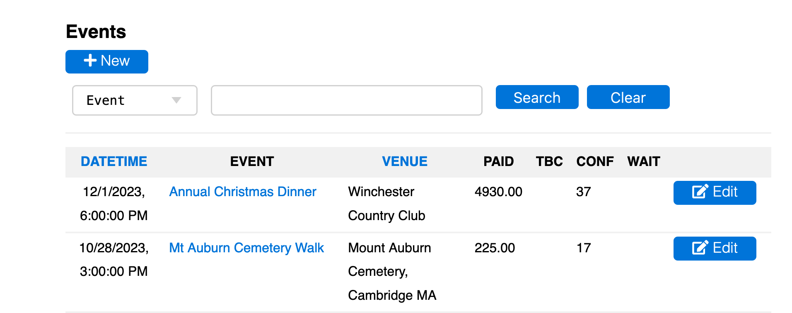

# [Oxford/Cambridge Alumni Group Database](index.md)

## Events Page

This grid is reached from 'Events' button on the blue navigation bar. Initially it presents an unfiltered grid of all event records (past and future) in reverse chronological order:

The **+New** button is used to create a new event. However, new events are usually more easily created by copying a similar existing event. To copy an existing event, find it on the events page, click 'Edit', and then use the 'copy this event' link.

The **Search** row allows search on (all or part of) an event name, venue, or speaker name.

The grid contains one row for each event, showing summary data including guest and waitlist counts, total ticket revenue as recorded in accounts or charged but not yet recorded, and any unpaid amounts (e.g. if a member checks out to confirm registration but does not complete the payment process). The TBC amount may be negative if guests have cancelled but no refund has been recorded.

The event name in a row is a link which opens up the [**reservation list**](reservation_list.md).
The **Edit/Display** button on the row allows the [**event record**](event_record.md) to be viewed or edited.

At the bottom of the page is an 'export' button allowing data on the selected events to be loaded into a spreadsheet, and an 'analytics' link which generates a spreadsheet on event attendance by member.
