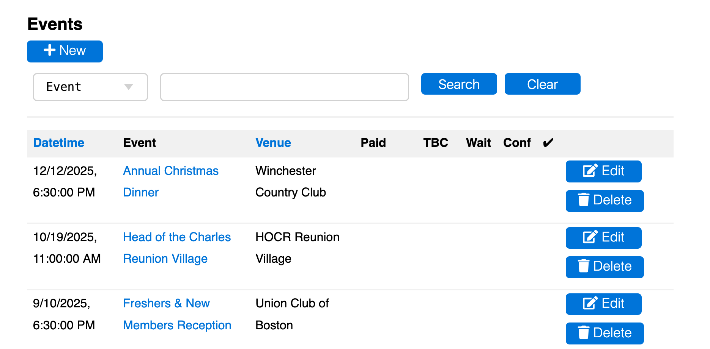

# [Oxford/Cambridge Alumni Group Application](index.md)

## Events Page

This grid is reached from 'Events' button on the blue navigation bar. Initially it presents an unfiltered grid of all event records (past and future) in reverse chronological order:

The **+New** button is used to create a new event. However, new events are usually more easily created by copying a similar existing event. To copy an existing event, find it on the events page, click 'Edit', and then use the 'copy this event' link.

The **Search** row allows search on (all or part of) an event name, venue, speaker name, or within the detailed description.

The grid contains one row for each event, showing summary data. The example shows future events where numberical values have not yet accumulated.

**Paid** is the total net ticket revenue for the event as recorded in accounting, or charged but not yet reconciled in accounting. It reflects any refunds that have been recorded in accounting.

**TBC** reflects the shortfall of ticket revenues on confirmed tickets, i.e. cases where an attendee has hit 'checkout' but did not complete payment. It can also be negative, i.e. if an attendee cancels but a refund is not made or accounted for (the reservation should be marked 'provisional' to remove it from the door list). The individual discrepancies will be visible on individual rows in the reservations list or provisional reservations list.

**Wait** is the total number of people (members and guests) waitlisted, **Conf** the total number confirmed (i.e. allocated places), and the final column (with a tick) the number who actually checked-in, after the event (assuming the check-in tool was used).

Clicking on the event name in a row opens up the [**reservation list**](reservation_list.md).
The **Edit/Display** button on the row allows the [**event record**](event_record.md) to be viewed or edited.

Events can be deleted only if there are no accounting transactions or reservations recorded.

At the bottom of the page is an 'export' button allowing data on the selected events to be loaded into a spreadsheet, and an 'analytics' link which generates a spreadsheet on event attendance by member.
