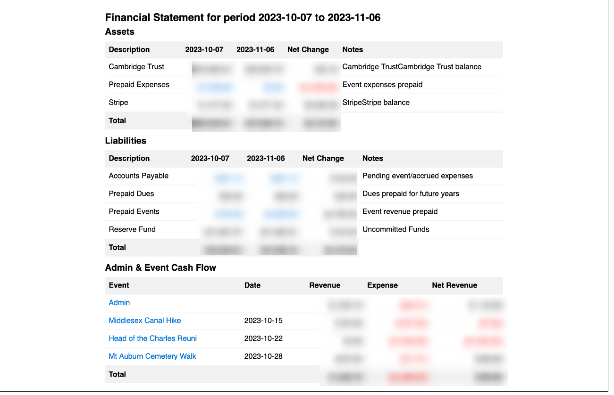
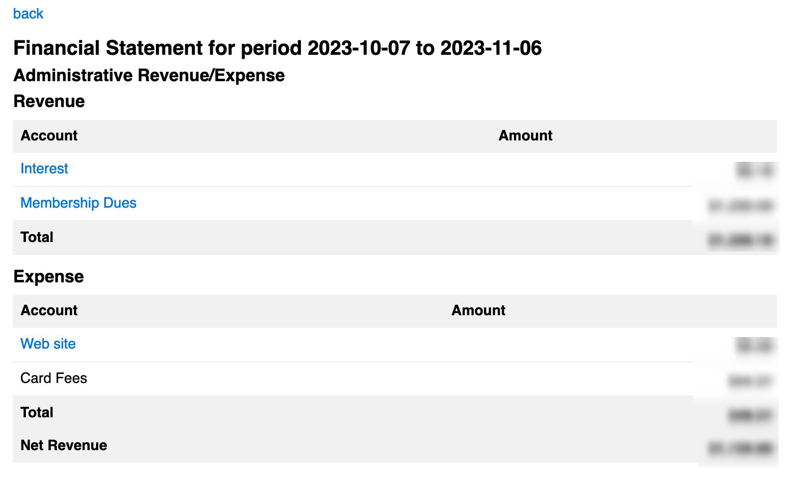

# [Oxford/Cambridge Alumni Group Application](index.md)

## Financial Statement

This page is reached from the link on the [accounts page](accounts.md) and selecting the desired date range:

The scope of the report covers all administrative expenses (and revenues such as membership dues) booked by the bank or card payment processor during the date range, together with all events that occurred during that date range. For the financial statement, all transactions associated with an event are included if the event date is within the date range, i.e. the statement is accrual based.

There are three sections in the financial statement:

- **Assets**. These include the balances at each bank and card payment processor, together with 'accounts receivable'. For each, the value at both start and end of the period is shown together with the net change. 'Accounts Receivable' and 'Prepaid Expenses' include any accrued items booked prior to the (start or end) date, and any actual revenue received for events prior to the (start or end) date but received later.

- **Liabilities**. These form the other side of the balance sheets and match the assets. 'Accounts Payable' includes accrued items booked prior to the (start or end) date, and any actual expenses for events prior to the (start or end) date but paid later. 'Prepaid Dues' represent the portion of the membership dues received prior to the (start or end) date but covering membership for years beyond the current membership year as of the date. 'Prepaid Events' are revenues already received or accrued for events taking place after the (start or end) date. Whatever remains  is classed as 'Reserve Fund', i.e. these are uncommitted funds.

- **Admin and Event Cash Flow**. This section includes one line for each event during the period, plus a line for 'Admin' - revenue and expense not associated with a specific event.

Certain numbers in the Assets/Liabilities sessions are links (blue) allowing drill-down to the individual transactions included.

The headings in the Cash Flow section are also links, allowing drill-down to the account level and from there to individual transactions, for example:

