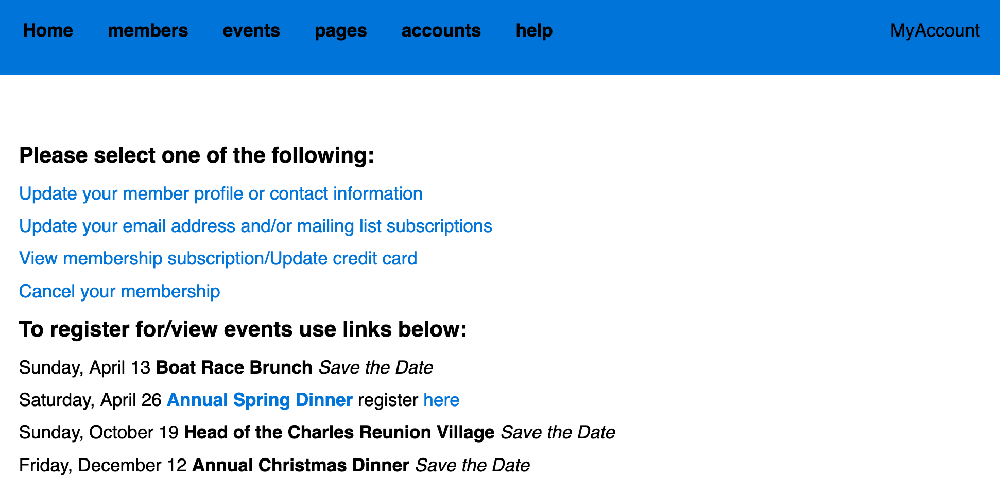

# Oxford/Cambridge Alumni Group Application - User Guide

The OxCam web application implements both the public web site for an Oxford and/or Cambridge alumni group and an underlying database for membership data and other functions. Note that a group may elect to create a separate public facing website but still use this application for its other capabilities.

This guide is intended for the volunteer organizers helping to run the organization whose interactions with the database are more complex. To return to this page from elsewhere in the guide click on the title.

The database includes:

- public website pages
- all member information (including current and past members, and mailing list subscribers)
- event information
- records of all membership dues payments
- records of event registrations
- accounting information
- the online payment mechanism
- email and notice capabilities

Organizers are assigned different access rights, ranging from read-only access to administrative capabilities, depending on their need to modify the database.

Users (both organizers and members) are identified by email address. They login by specifying their email address, then clicking on a link (containing a one-time security code) sent to that email.

The landing page of the management portion of the application is reached at, for example, [https://oxcamne.pythonanywhere.com/oxcam](https://oxcamne.pythonanywhere.com/oxcam) for the OxCamNE database hosted on PythonAnywhere. This page can always be reached using the MyAccount button. This is used both by organizers and members, and looks like:

The page banner for the Society is followed by a navigation bar. Both the navigation bar and the content depend on the user identified by the email address. For a regular member only the Home and MyAccount buttons are shown, and they will usually be using a link that takes them directly to a specific function, such as registering for an event, rather than landing here.

The **Home** button links to the home page of the Society's public web site, and is always shown. Hovering over **MyAccount** produces a dropdown menu:

- *MyAccount* returns from anywhere to this page
- *Directory* leads to the member directory
- *Logout* does what it says!

The [**members**](members), [**events**](events.md), [**pages**](pages.md), [**accounts**](accounts.md), and **help** buttons are shown only to organizers of the group who have been granted database access rights, and lead to the corresponding modules of the application.

If you are installing or supporting the database please see the [**Support Guide**](support.md).
