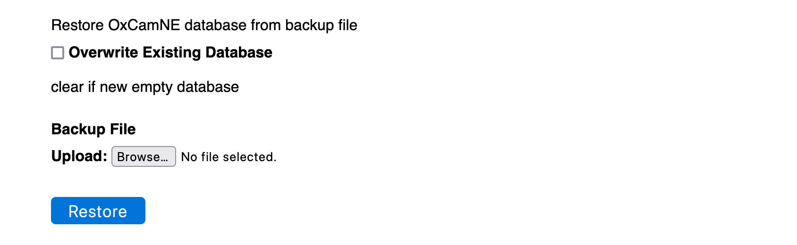
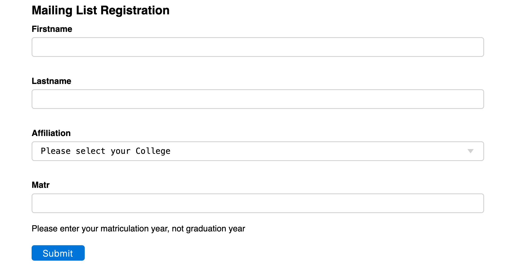

# [Oxford/Cambridge Alumni Group Database - Support Guide](support.md)

## Installation

The oxcam software is held on Github at [https://github.com/oxcamne/oxcam](https://github.com/oxcamne/oxcam). This section assumes that you have read the README displayed there and satisfied the pre-requisites, so that you have a web server successfully running Py4web.

On your server open a bash terminal session at the py4web 'apps' directory, issue the commands:

```bash
    git clone https://github.com/oxcamne/oxcam.git
    pip install --upgrade -r oxcam/requirements.txt
```

This clones the software into a new directory apps/oxcam, and ensures that necessary Python packages are installed. You may need to precede 'pip' with 'python ' or 'python3 ' depending on your environment.

### Configure the software for your organization

You next need to create a 'settings_private.py' file in apps/oxcam. Customize the contents from the code below, which is taken from the OxCamNE environment (with sensitive keys removed). A copy of this is included in the kit as settings_private_template.py which you can copy or rename:

```python
"""
Configures the app for a particular alumni group/Society,
and for a particular running instance, e.g. production or development
Customize for your organization and instance
"""
import datetime
from dateutil import tz
from py4web.utils.mailer import Mailer

# database connection string:
DB_URI = "sqlite://storage.db"
"""
SQLite is built into Py4web and should be adequate except for large groups.
On PythonAnywhere you can alternatively use MySQL, e.g.:
DB_URI = "mysql://oxcamne:<--- database password here --->@oxcamne.mysql.pythonanywhere-services.com/oxcamne$default"
DB_POOL_SIZE = 10
"""

# set True only for live production instance
IS_PRODUCTION = True
#if False, email is suppressed except to the following:
ALLOWED_EMAILS = ['dgmanns@gmail.com', 'secretary@oxcamne.org', 'david.manns@trinity.cantab.net']

# if True, run email daemon & daily maintenance in server threads
THREAD_SUPPORT = False
# Note, PythonAnywhere doesn't support threads, must run
# these processes as scheduled tasks. Set True if your
# environment supports threads.

# access levels for group administrators do not change
ACCESS_LEVELS = ['read', 'write', 'accounting', 'admin']

#see https://en.wikipedia.org/wiki/List_of_tz_database_time_zones
TIME_ZONE = tz.gettz('America/New_York')

# Customize the following group for your organization:
# URL for this oxcam database server:
DB_URL = "https://oxcamne.pythonanywhere.com/oxcam"
# organization name and domain/short_name, etc:
SOCIETY_NAME = 'Oxford & Cambridge Society of New England'
SOCIETY_SHORT_NAME = 'OxCamNE'
# html web page banner Customize:
PAGE_BANNER = '<h4><span style="color: blue"><em>\
Oxford and Cambridge Society of New England</em> </span></h4>'
# NOTE the logo image is in py4web/apps/oxcam/static/images
HOME_URL = 'https://sites.google.com/oxcamne.org/home/?authuser=1'
        #this version allows authorized users to edit
HELP_URL = "https://sites.google.com/oxcamne.org/help-new/home?authuser=1"
PUBLIC_URL = 'www.oxcamne.org'
        #domain service re-routes to sites.google
SUPPORT_EMAIL = 'secretary@oxcamne.org'
# html letterhead for email/notices:
LETTERHEAD = '<h2><span style="color: blue">\
<em>Oxford and Cambridge Society of New England</em></span> \
</h2>\
<h3><span style="color: blue"><em>&lt;subject&gt;</em></span></h3>'
        #NOTE 'subject' replaced by full subject line in emails/notices
# html trailer for email notices:
VISIT_WEBSITE_INSTRUCTIONS = "<br><br>Visit us at www.oxcamne.org or \
https://www.instagram.com/oxcamne/ or www.facebook.com/oxcamne"

# html description for mailing list selection
# must correspond to mail lists defined in database Email_Lists table.
MAIL_LISTS = f"The <b>Group Mailings</b> list is used for all {SOCIETY_SHORT_NAME} notices."

# Paid membership categories, else empty list:
MEMBER_CATEGORIES = ['Full', 'Student']
# set to '[]' if your organization doesn't have paid memberships

# html description of paid membership criteria:
MEMBERSHIP = "Membership is open to all matriculated alumni and members of the \
Universities of Oxford and Cambridge.<br><br>\
Annual dues are $30 payable by subscription. In future years, you'll receive a \
reminder a week before the next auto-payment is made. \
Full time students, or those graduated within the last 12 months, qualify for student \
membership at $10 (please note your course and graduation date).<br><br>"

GRACE_PERIOD = 45
"""
Renewal within this number of days after expiration extends membership
continuously from the expiration date.
Also, member can renew this number of days prior to expiration. 
Renewal notices are sent at expiration plus -9, 0, 9, 18 days.
Auto renewal will be attempted multiple times at the anniversary of payment
and during following 3 weeks. So we set the grace period to cover 18+21 \
days.
"""

# email settings use in common.py to construct auth.sender which is used for all
# transactional messages (low volume of messages)
SMTP_SSL = False
SMTP_SERVER = "smtp.gmail.com:587"
SMTP_SENDER = "Oxford & Cambridge Society <oxcamne@oxcamne.org>"
SMTP_LOGIN = "<--- gmail login with app password --->"
SMTP_TLS = True

#define the bulk email sender for mailing list use etc.
# smaller organizations (up to a few hundred on mailing list) could even
# use the same account as above
BULK_SENDER =  Mailer(
        server="smtp.mailgun.com:587",
        sender="Oxford & Cambridge Society <oxcamne@oxcamne.org>",
        login="postmaster@<---- domain SMTP login ---->",
        tls=SMTP_TLS,
        ssl=SMTP_SSL,
)

# payment processor (currently only stripe implemented):
PAYMENT_PROCESSOR='stripe'  
#Stripe settings development keys and id's
STRIPE_PKEY = "<--- Stripe public key --->"
STRIPE_SKEY = "<--- Stripe secret key --->"
# specific products for membership dues
STRIPE_PROD_FULL = "<--- Stripe product id -->"  #Annual, autorenews
STRIPE_PROD_STUDENT = "<--- Stripe product id -->"    #Annual, no autorenew
```

Notes:

1. The database is configured to use SQLite - this probably provides adequate performance
for all but the largest groups.

1. Setting IS_PRODUCTION False only prevents the daily maintenance process from
sending out notices such as membership dues reminders. Any test environment can still send out email, so care needs to be taken not to generate unexpected traffic.

1. Set THREAD_SUPPORT True only if your environment supports threading. PythonAnywhere does not, but typically a desktop development environment does. If set True, then the email daemon is started in its own thread whenever py4web/oxcam is started, and in turn spawns the daily_maintenance job in its own thread at midnight.

1. There are various 'branding' elements such as logo, organization name,
web site addresses, help site address (for volunteers), support email, etc.
The help site might embed the [User Guide](https://oxcamne.github.io/oxcam) and
possible also this [support guide](https://oxcamne.github.io/oxcam/support) as
well as including organization specific information.

1. A single mailing list is assumed. An organization can operate multiple
mailing lists. MAIL_LISTS is simply an html description, the mailing lists
themselves are set up in the database Email_Lists table.

1. In the prototype membership categories are included for full and student
members. You do not have to have paid memberships.

1. There are two groups of settings for outgoing email, each of which configures an SMTP Mailer. The first is for transactional emails, such as login email verification, transaction confirms, and emails addressed explicitly. In the case of OxCamNE, this uses the Society's Google Workspace address, <oxcamne@oxcamne.org> using an app password.

1. The second mailer is for bulk emails, sent to mailing list or filtered sets of members. Smaller groups could re-use the same account as above, which may accommodate up to a few hundred addresses.
Above that a paid email service such as mailgun.com needs to be used.

1. There is a group of settings for the Stripe payment processor. These include public and private account keys, and product identifiers corresponding to the membership categories.
The products are set up on the Stripe dashboard and define the membership annual dues. In the OxCamNE case Student membership must be manually renewed annually, whereas Full membership sets up an auto-renewing subscription.

### Start the database

Once the app is installed and your settings_private.py file is configured you should restart py4web. If py4web is already running you can use the 'Reload Apps' button in the 'Installed Applications' section of the Py4web Dashboard. You should now see the oxcam app running
as an installed application.

When first started the app creates an empty database in a databases/ folder in the py4web/apps/oxcam directory.

### Load a Minimal Database

Browse to the database at \<your_py4web_url\>/oxcam. You will be asked to login using your email. Oxcam sends a one-time
link to your email. The link opens a new tab ready for you to upload a copy of database contents:



The kit contains a file, db_oxcam_minimal.csv in the py4web/apps/oxcam directory. Csv files are used to backup and restore the contents of the database.
The minimal database defines the Colleges table including all the
Oxford and Cambridge Colleges, defines the default mailing list, a prototype chart of accounts, sample bank and payment processor records as well as some bank rules.

To use the minimal database file, copy it from the kit to your local device where you browser is running. Click Browse and find the .csv file, then click restore. You will then need to login once more, and will be taken to the index page:


### Add yourself to the database

The database does not contain any member records so can not do anything very interesting. If you do not have membership configured, you'll see only the
mailing list option. Either joining the mailing list or as a member creates a
member record. The form to join the mailing list looks like:



Once you have created your own record, as it is first into the database it is automatically assigned 'admin' access and all the function links appear on the navigation bar:


If your group is for alumni of only one of the Universities, you may wish to eliminate the irrelevant Colleges. You can use **db_tool** to do this.

### Scheduled Tasks

Oxcam uses two additional tasks that run separately from the web server.
If your environment supports threads, and you configure 'THREAD_SUPPORT = True',
nothing more is needed:

- the email daemon runs all the time in its own thread. It's role is to spool
out notices to a mailing list or other selection of members. These emails may
be customized with a greeting or other information, such as registration details.

- the daily maintenance task is triggered at midnight local time each day. It's
role is to send out any necessary membership renewal reminders, and to generate
a database backup .csv file. It retains on the local drive the last month's daily files, and files from the 1st of each month for a year.

In the PythonAnywhere enviroment, the email daemon is configured as a 'run forever'
task, and the daily maintenance job is scheduled at a fixed UTC time daily. The commands to use are:

```bash
py4web/py4web.py call py4web/apps oxcam.email_daemon.email_daemon

py4web/py4web.py call py4web/apps oxcam.daily_maintenance.daily_maintenance
```
