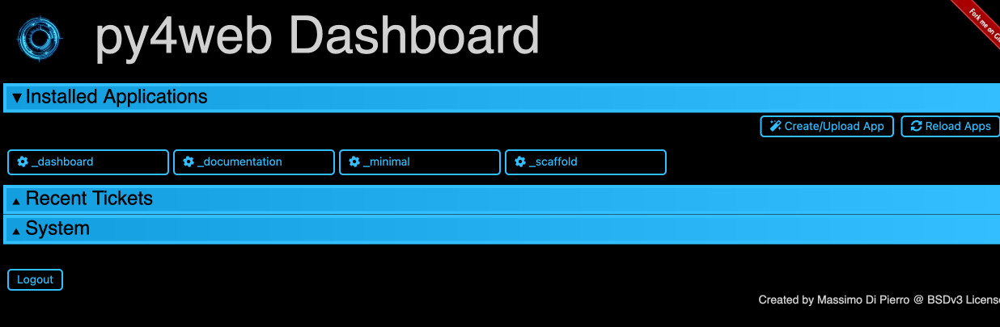
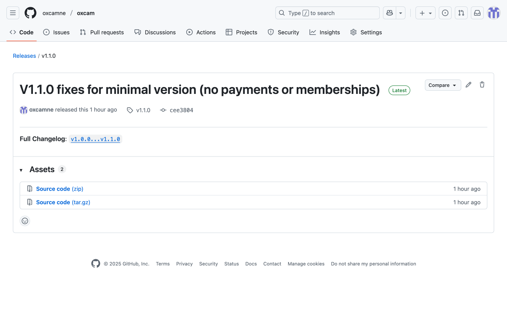
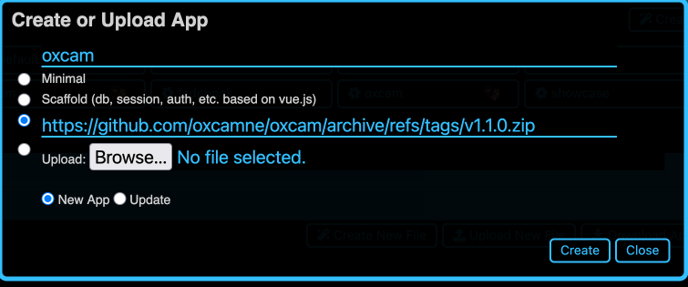
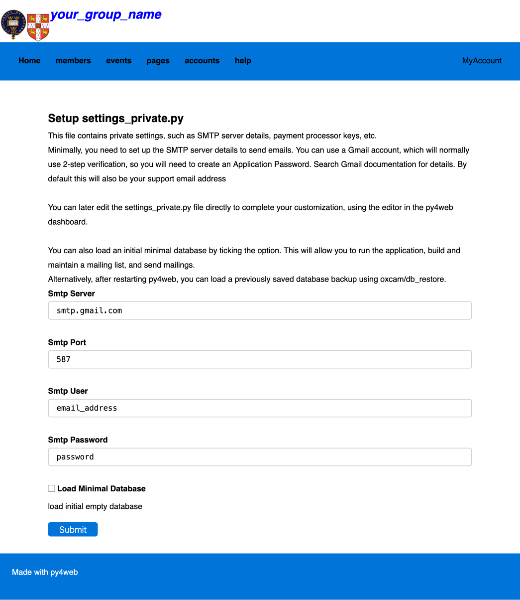

# [Oxford/Cambridge Alumni Group Application - Support Guide](support.md)

## Installation

This documentation is intended for groups adopting oxcam to run their website and database.

The oxcam software is held on Github at [https://github.com/oxcamne/oxcam](https://github.com/oxcamne/oxcam). This section assumes that you have read the [README](https://github.com/oxcamne/oxcam?tab=readme-ov-file) and that you have a web server ready to host py4web and the oxcam app.

The server might be an account on a cloud based hosting service such as [Pythonanywhere](https://www.pythonanywhere.com). The more technically adept could use a desktop Mac, Windows, or Linux machine.

For technical users contributing to the support/development of the oxcam app, see [development installation](development_install) for information on setting up your development environment.

### Install Py4web

If you are installing on Pythonanywhere, [please follow this process](py4web_pythonanywhere). You will use the Pythonanywhere console to start, stop and restart your py4web server.

Otherwise using a terminal where you wish to create your virtual environment and py4web:

```bash
mkdir py4web
cd py4web
python3 -m venv venv
. venv/bin/activate
pip install --upgrade py4web --no-cache-dir
py4web setup apps
py4web set_password
py4web run apps
```

When running `py4web setup apps` be sure to answer 'Y' to create the apps directory and to load, at a minimum, the _dashboard app.

If you are later restarting your terminal to run py4web remember to re-enable your venv:

```bash
cd py4web
. venv/bin/activate
py4web run apps
```

Your terminal prompt should show that the (venv) is in place, e.g.:

`(venv) davidmanns@Mac py4web %`

Verify that you can open the Py4web dashboard (<your_py4web_url>/_dashboard) in a new browser tab, using the password you setup when installing py4web. When you expand the 'Installed Applications' section it should look something like this:



### Download the latest version of the oxcam software

Open a new browser tab and browse to [https://github.com/oxcamne/oxcam](https://github.com/oxcamne/oxcam) and click on the latest version of OxCam on the releases section on the right of the page. You should see something like:



Right-click on the Source code (zip) link under 'Assets' and select 'copy link'

Return to the Py4web Dashboard tab, and click Create/Upload App. Fill in the popup form, pasting in the link copied from Github:



If this is your initial install, select the New App radio button, if you are updating to a new version of oxcam, select Update.

Click the 'Create' button, the oxcam software will be installed and dashboard should now show that oxcam is running. You can close your Github browser tab.

If this is your initial installation of oxcam, you will need to install some additional Python modules on which it depends. With your terminal still at the py4web directory, type the command:

`pip install --upgrade -r apps/oxcam/requirements.txt`

Finally, reload the apps using the 'Reload Apps' button on the Py4web Dashboard.

### Start Oxcam and Initial Configuration

In a new browser tab, start the oxcam app (<your_py4web_url>/oxcam). You should see a screen like this:



Follow the on-screen instructions to define the email account to be used by oxcam. Normally you would also tick the 'load minimal database' checkbox.

After successfully submitting the form, return to the Py4web dashboard and **click the Reload Apps button** to restart the oxcam software.

### Start Building Your Database

Open a new browser tab and browse to <your_py4web_url>/oxcam. Login using your personal email. The address you specified in the setup form will be used to send an email verification message to your personal account.

If you checked 'Load Minimal Database' in the setup form, the login will take you to the My Account menu which will include the option to join the mailing list. Joining the mailing list will create your 'member' account with full admin privileges. You now have a working Oxcam system that can manage a mailing list and free events, but without paid events, paid membership categories, online payments, or accounting.

The minimal database initializes the content copied from our OxCamNE database in the tables: Colleges, Email_Lists, Pages, CoA, Bank_Accounts, and Bank_Rules. Any and all of these tables you may wish to edit once your are up and running, for example many of the web pages may be inapplicable or need modification for your group, but having all these elements in the minimal database provides useful templates.

If your group is for alumni of only one of the Universities, you will wish to eliminate the irrelevant Colleges. You can do this by going to the 'Databases in Oxcam' section of the Py4web dashboard and clicking the button for the db.Colleges table. Type e.g. 'name contains oxford' to identify the colleges you **don't** want and then you can easily delete them.

If you did not load the Minimal Database, the login will take you to a database restore page:


Use the 'browse' button to locate the backup database you wish to load. You do not need to click 'clear existing database'. After the database is loaded, you will need to log in again which will connect with your record in the restored database.

### Complete the customization for your group

Further customization is done by editing the settings_private.py file just created. You can use the Py4web dashboard app to do this, restarting the running apps after saving all edits.

In the dashboard 'Installed Applications' section, click on the 'oxcam' app. Then find 'settings_private.py' in the 'Files in oxcam' section. This opens the file in an editor (scroll down if necessary).

This is a Python file, and the Dashboard's editor is python aware, so it will flag any syntax errors. The file is self documented, go through it carefully to make the necessary customizations.

### Scheduled Tasks

Oxcam uses two additional tasks that run separately from the web server.
If your environment supports threads, and you configure 'THREAD_SUPPORT = True',
nothing more is needed:

- the email daemon runs all the time in its own thread. It's role is to spool
out notices to a mailing list or other selection of members. These emails may
be customized with a greeting or other information, such as registration details.

- the daily maintenance task is triggered at midnight local time each day. It's
role is to send out any necessary membership renewal reminders, and to generate
a database backup .csv file. It retains on the local drive the last month's daily files, and files from the 1st of each month for a year.

In the PythonAnywhere enviroment, the email daemon is configured as a 'run forever'
task, and the daily maintenance job is scheduled at a fixed UTC time daily. The commands to use are:

```bash
py4web/py4web.py call py4web/apps oxcam.email_daemon.email_daemon

py4web/py4web.py call py4web/apps oxcam.daily_maintenance.daily_maintenance
```

### How to update the oxcam app when a newer version is released

The Py4web Dashboard should be used to update the oxcam app. Open the Py4web dashboard (<your_py4web_url>/_dashboard) in a new browser tab, using the password you setup when installing py4web, and expand the 'Installed Applications' section.

Follow a similar process to the original install to [install the new version of the oxcam app](install#download-the-latest-version-of-the-oxcam-software).

### How to update to a new release of Py4web

If your server is a Pythonanywhere instance:

With a bash terminal at your py4web directory run the command:

`python3 -m pip install --upgrade py4web`

This will not update the built in apps. *To update these, first go the py4web/apps directory and delete the folder for the app to update (most likely '_dashboard')*. Then return the terminal to py4web and run:

`py4web setup apps`

Finally, you must restart py4web, either using the big green button on the Pythonanywhere console web tab.

If you are running on another type of server, on the terminal running py4web, first stop py4web (type control-C), verify that your venv is running as indicated by '(venv)' at the start of the prompt - if not, run:

`. venv/bin/activate`

Then run the commands:

`pip install --ugrade py4web`

This will not update the built in apps. *To update these, first go the py4web/apps directory and delete the folder for the app to update (most likely '_dashboard')*. Then return the terminal to py4web and run:

`py4web setup apps`

Finally, restart py4web:

`py4web run apps`
