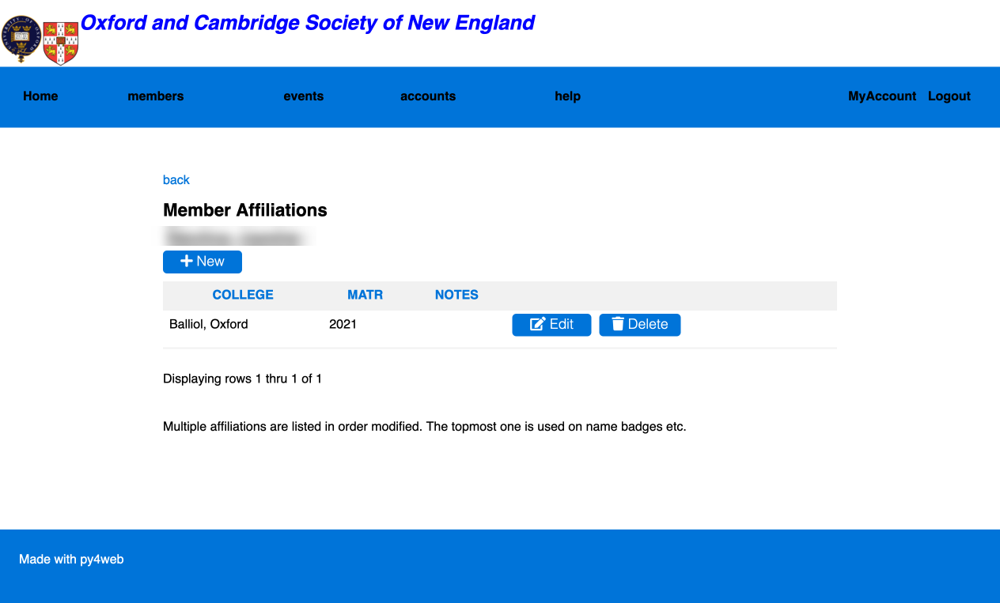

# [Oxford/Cambridge Alumni Group Application](index.md)

## Members Affiliations Page

This screen, reached from the [member record](./member_record.md) displays a member's affiliations, in the order each affiliation record was modified:

Members use a similar screen if they wish to enter multiple affiliations. The top entry is used for name badges. All listed affiliations appear in the member directory. You can rearrange multiple affiliations by editing them; submitting an edit (even if nothing is changed) moves that particular entry to the end of the list.

When College names are changed, or new Colleges added, the table of Colleges can be adjusted using the py4web dashboard. Whilst we might edit the name of a College, we should never delete it's record as this would also delete it's historical affiliations.
