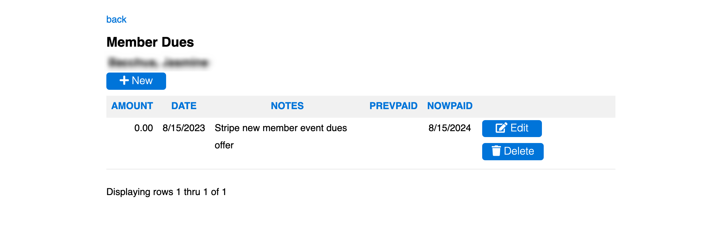

# [Oxford/Cambridge Alumni Group Database](index.md)

## Members Dues Page

This screen, reached from the [member record](./member_record.md) displays a member's dues payments, in the reverse chronological order:

This page allows one to review a member's membership history, including any gaps in membership.

Normally, the only reason to do anything other than view would be to add a record in order to record a renewal made by check payment. Adding a dues check by adding a record using the +New button automatically updates the 'Paiddate' in the member record to the 'Nowpaid' date specified in the 'Add Record' form, which defaults to one year from the existing 'Paiddate'  (or the current date for a new member).
