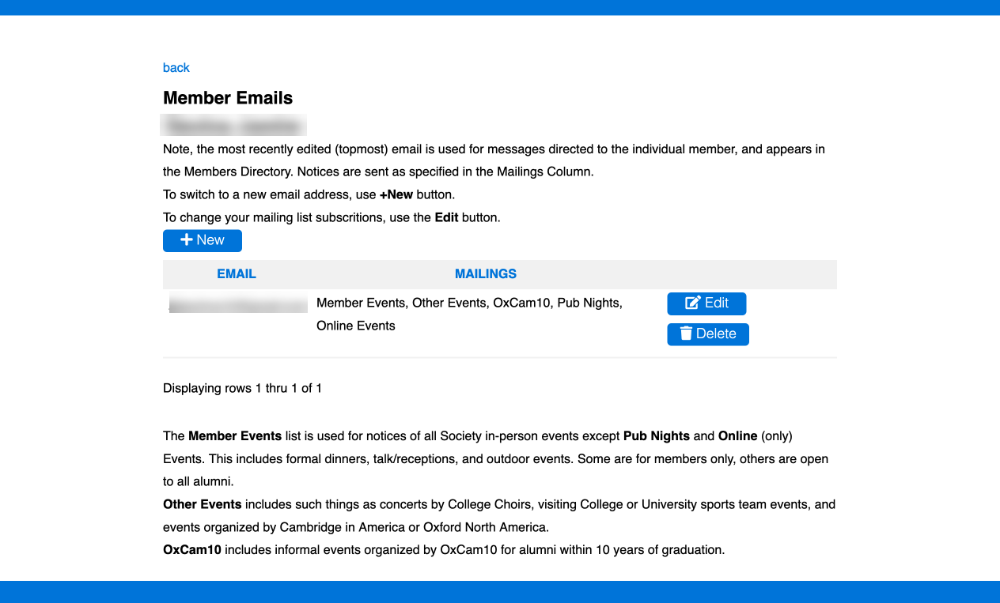

# [Oxford/Cambridge Alumni Group Application](index.md)

## Members Emails Page

This screen, reached from the [member record](./member_record.md) displays a member's email addresses, in the order each email record was modified:

This page is used, for example, to add or remove Society addresses as roles change, or when members make requests. Members can in fact manage their email addresses themselves using a similar screen.

Editing a row allows modification of the mailing list subscriptions for that email address.

Changing a member's email address should be done by adding the new address. We generally keep the old address in the database, allowing the user to login with either old  or new address.

The text at the bottom of the page describes the various mailing lists, and is held in settings_private.
