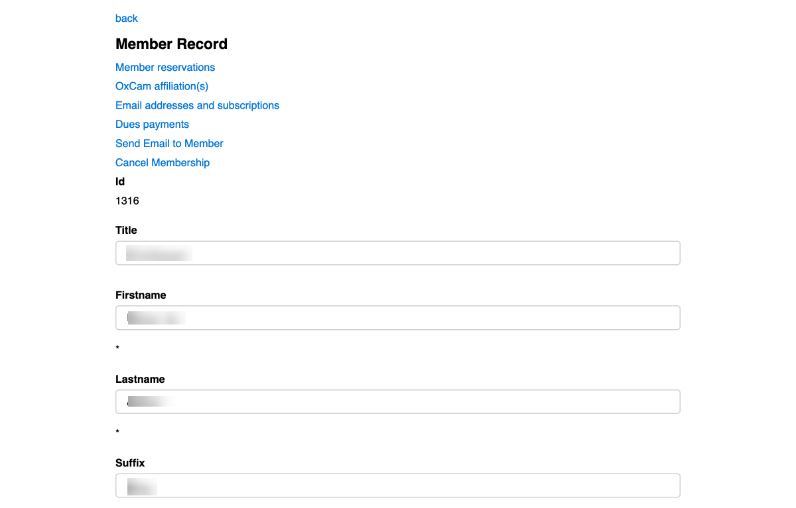
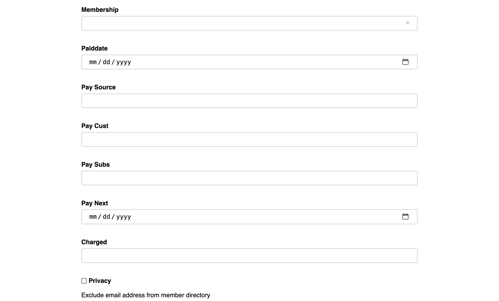
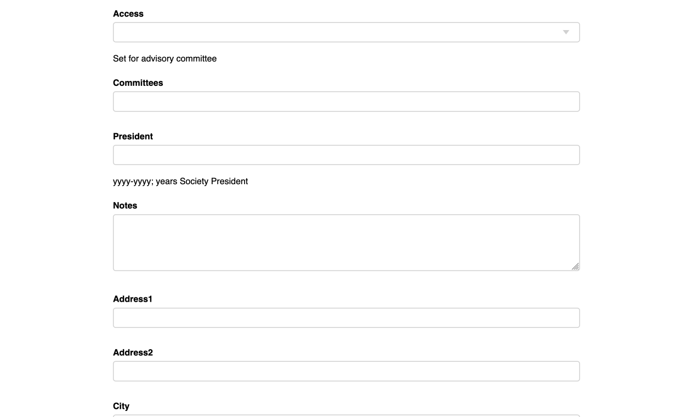

# [Oxford/Cambridge Alumni Group Database](index.md)

## Member Record

This page is reached through the Edit button on a member row of the [Members Page](members) or from a [member reservation](event_registration.md). Note that organizers generally don't have to edit the member records - everything is normally gathered by the database directly from the members. At the top of the page:

The page begins with a menu of links to further screens:

Many of the database pages have a **'back'** link at the top. This differs from the browser's back link in that it will take you up a level, e.g. in this case back to the filtered members grid, even though you may have traveled through other pages 'below' the current page.

[Member reservations](member_reservations.md) allows you to review the events the member has attended or registered forward. You can also create a new registration, such as to register the speaker for an event.

[OxCam affiliation(s)](member_affilitions.md) allows you to review/edit the member's college affiliations.

[Email addresses and subscriptions](member_emails.md) allows you to review/edit the user's email address(es) and mailing subscriptions.

[Dues payments](member_dues.md) allows you to review the record of dues payments the member has made, or to add a record of such payment made by check, for example.

If you own a Society email address there is a link to [send Email](send_email.md) to the displayed Member.

If the displayed member is in good standing, an additional Cancel Membership menu item. Clicking this will ask for confirmation, and it will cancel the Stripe subscription if any, mark the member as cancelled, and send a confirming message to the member.

The next few fields relate to membership status. If **Membership** is blank, the record is either historical or just belongs to a mailing list. Otherwise the member will be included in the Member Directory, though is not necessarily in good standing. My practice has been to clear the Membership field if a member remains unpaid for a couple of years. This can be done in bulk using db_tool.

**Pay Source** indicates the payment processor where the member's account is set up. Currently, Stripe is the only supported payment processor.

**Pay Cust** is the payment processor's customer id for the member. The member will have pay source and pay cust if they have ever made an online payment to us.

**Pay Subs** may show 'Cancelled' in which case Paiddate indicates the effective cancellation date. Otherwise, a value in Pay Subs indicates that a subscription is in place and renewal should be automatic. **Pay Next** shows the date on which the next renewal will be charged; if this is in the past it means that payment either failed or has not yet been downloaded from the payment processor and reconciled. Several attempts are made to collect after prompting the member to update their card details, before eventually cancelling the subscription.

A value in **Charged** reflects a manual card payment that has not yet been reconciled in the accounting module, at which point Paiddate will be updated. Dues payments made by check on the other hand are not reconciled automatically in the accounting module and should be recorded through the dues page.

We have a few honorary 'life' members where 'Membership' shows 'Comp' (or 'Full') and 'Paiddate' is blank. Typically we now instead  offer a year's free membership for dinner speakers, after which we prompt them to renew.

Note that the Membership Database automatically reminds members to renew if they are Student members, have paid by check, or are ending their complimentary year after speaking at an event. These messages are sent by the daily_maintenance task.

If privacy is ticked, the member does not wish to have their email address included in the member directory.

The next group of fields also requires some explanation and reflects the member's service on our committees and as officers.

Organizers are given the appropriate level of access to the database by selecting a value for the **Access** field of their record.

We use **Committees** to record membership in the Society's committees. All active committee members should be recorded as members of 'advisory', with Board members also showing as both 'advisory' and 'board'.

A member's service as a past President is represented by recording the years of office in the **President** field.

The organizers can use the **Notes** field to record anything of significance regarding the member.

The remaining fields are for address and phone numbers, and are supplied by the member when joining. The fields marked with '\*' are required when joining.

Note that the website about page is generated using the 'Committees' and 'President' fields of the member records, along with the associated email records, which should be maintained in parallel with the Google Workspace users and group lists.
