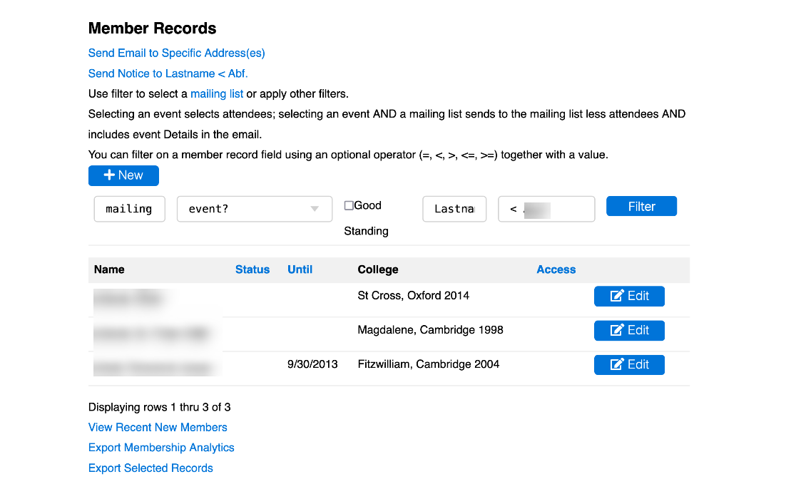

# [Oxford/Cambridge Alumni Group Database](index.md)

## Members Page

This grid is reached from 'Members' button on the blue navigation bar. Initially it presents an unfiltered grid of all database member records:

Each row of the grid shows a member record, with the membership status and currently paid date and their affiliation. The Access column highlights members having some level of general access to the  database, normally  Advisory Committee Members. The Edit (or View) button shows the details of an individual [**member record**](./member_record.md).

### Filtering

Above the grid is a filter form that allows you to find a specific record, or to select a set of records of interest, e.g. to send out a mailing.

The filter selections can be used in combination. The leftmost is a dropdown allowing a mailing list to be selected.

Next, another dropdown selects an event. The events are listed in reverse chronological order. If used in combination with a mailing list members already registered are excluded (e.g. on a registration reminder), otherwise confirmed attendees are selected.

There is a tickbox to select members in good standing, i.e. up to date with dues payments.

The final pair of boxes allows for searches on fields within the member records. First, select the field of interest from the field dropdown, then the value to be  searched for. A simple example would be to search by last name. When searching a text field like this, the value can occur anywhere in the field. You can also use '%' as a wildcard, for example searching the 'access' field for '%' will display all records having any privileged access to the database.

Some fields have date values, e.g. Paiddate, Pay_next. The search value should be in mm/dd/yyyy format with a four digit year. You can use an operator such as '<' ('=' is assumed otherwise). So for example Pay_next < today's date shows any auto-renew members whose renewals are failing (e.g. expired card).

Each row of the grid shows a member record, with the membership status and currently paid date and their affiliation. The Access column highlights members having some level of general access to the  database, normally  Advisory Committee Members.

### Email

If you have a Society email address, the link above the grid allows you to compose and send email to any email address(es). And if a list of members has been selected using the filter, there will be an additional link to send a notice to that list.

### Add Member

You can use the '+New' button to add a new member after determining no record exists. Normally members add themselves in the process of joining, subscribing to email, or registering for an event. Sometimes it is necessary to add a record for a speaker.

Another situation where a member record needs to be manually added is that where a person with no college affiliation is to be admitted as a member. Examples include someone who has had a university appointment (such as Research Assistant), or the spouse of a deceased member who wishes to remain a member. See the 'how to'.

### Member Details

Use the Edit or Display button on a row to drill down into the details of that member. This displays the contents of the member record itself and provides links to add/edit email addresses and subscriptions, affiliation records and more.
Page Navigation & Information Export

### Multi-page Navigation

Below the grid you can see how many records were selected. Up to 15 records
will be shown at a time. If there are more, there will be buttons at the bottom
to navigate from page to page.

### Export Links

At the very end of the page are several links for exporting member data from
the database.

*View Recent Dues Payments* displays a grid of membership dues payments in reverse chronological order (a date range can be selected), without regard for the member filter. This information normally finds its way into the Membership Secretary's report - there will be a link below the displayed results to export a .csv file.

*Export Membership Analytics* is used by the Membership Secretary to analyze year to year membership demographics; it is also exported in raw .csv format.

*Export Selected Records* exports a .csv file including all member records, or those selected by the filter if a filter is used.
