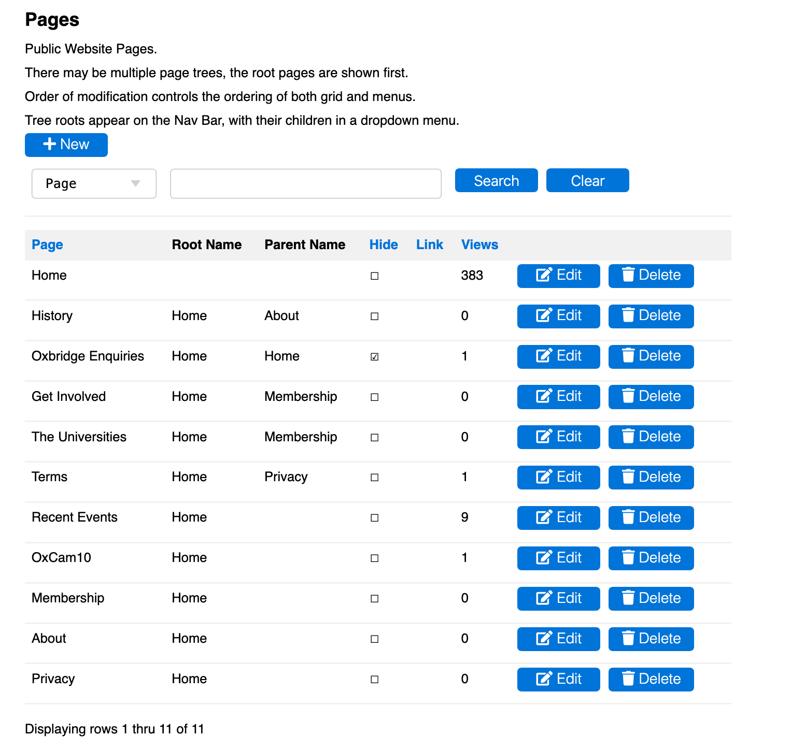

# [Oxford/Cambridge Alumni Group Application](index.md)

## Pages Page

This grid is reached from 'Pages' button on the blue navigation bar. Initially it presents an unfiltered grid of all web pages in the database:

The **+New** button is used to create a new page. Go to [Pages Record](pages_record.md) for information on constructing and editing Content.

Multiple sites can be constructed in the database, though the example shows only one, the main public website 'home'. I will also be migrating the organizers' help site shortly. Note that these two web sites' addresses are configured in the settings_private.py file.

The first page created is assumed to be the public website home page. There is a robots.txt file in the static directory which allows web crawlers to find this page.

When a page is viewed, the Nav Bar will show the corresponding root page followed by all other pages with the same root but no parent, in order most recently modified. Pages with a parent appear on a submenu which appears when the parent is hovered over. Submenus can be nested, and are displayed in the order the pages were most recently modified.

If the 'Hide' column is ticked, the page will not appear on Nav Bar or submenus, presumably there is a link to it somewhere.

If a 'Link' is shown, the page is located in an external site.

'Views' shows the number of page views.

Note that deleting a page will delete all subpages. Deleting a root page will delete the whole site!!
