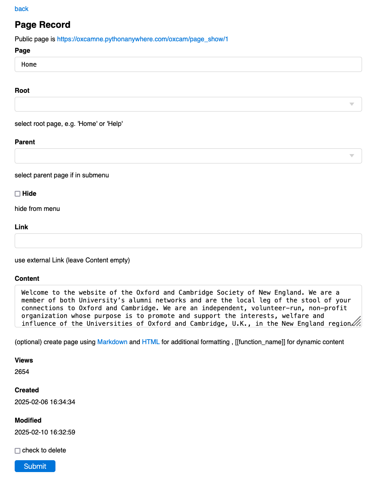

# [Oxford/Cambridge Alumni Group Database](index.md)

## Pages Record

This record represents a publicly displayable web page.

This page is reached through the Edit button on an page row of the [Pages Page](pages.md):

The **back** link will take you back to the pages page.

Similarly, the page's link is shown; it may be on an external site (specified in the **Link** field), or internal to the database (**Content** field of the pages record).

The **Content** is written in Markdown, and typically also includes HTML elements.

All the other fields are self explanatory or discussed on the [Pages Page](pages.md).

There are links to Markdown documentation and to HTML documentation, specifically discussing the inclusion and formatting around images.
