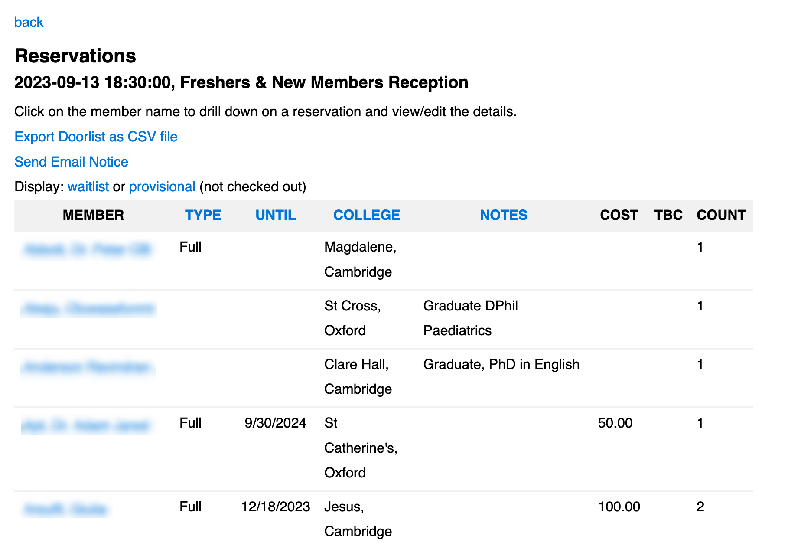

# [Oxford/Cambridge Alumni Group Database](index.md)

## Reservation List

This page is reached by clicking on an event name on the [Events Page](events.md). At the top of the page:

The **back** link will take you back to the events page.

The page normally shows confirmed registrations, but links allow the **waitlist** or **provisional registrations**. Registration is provisional until the member clicks 'Checkout' at which point it is either confirmed or placed on the waitlist.

Confirmed reservations can be exported using the **Export Doorlist as CSV file** link. The resulting spreadsheet can be used to print the doorlist, generate name badges, plan table assignments, etc. The door list includes all confirmed members and guests. See the 'how to' for help in preparing name badges.

The **Send_Email_Notice** link allows sending notices to attendees, waitlisted, or unchecked out members. Note that the message can be customized using \<greeting> and \<reservation> elements.

Each row shows one member booking. Additional guests are reflected only in the count. Note that an individual reservation may contain both confirmed and wait listed or provisional guests if the member adds additional guests after checking out, and does not successfully checkout the additions.

**TBC** indicates any unpaid amount relating to confirmed tickets. Email confirmation is not sent until any necessary payment is completed. **Cost** is the total cost for both member and guests.

Click on the member name to display the [full details of the reservation](event_registration.md).
