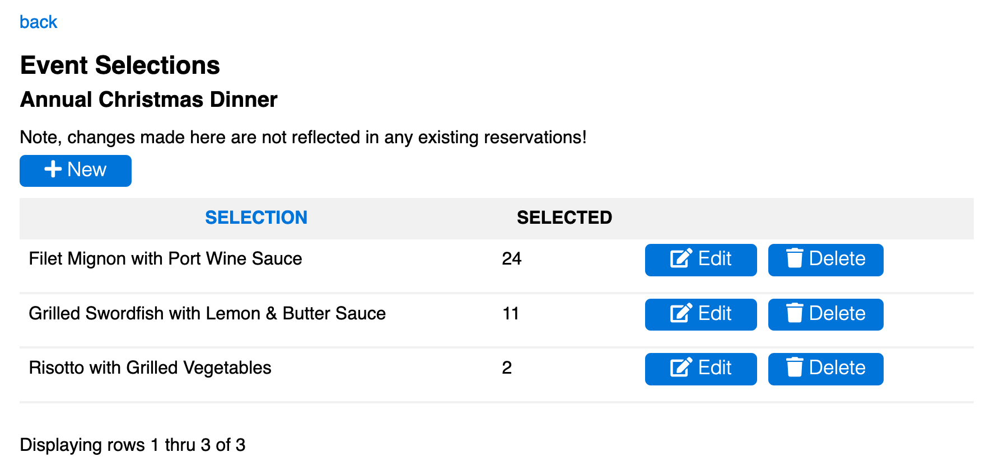

# [Oxford/Cambridge Alumni Group Application](index.md)

## Selections Page

This page is reached from the 'Selections' link at the top of the [event record](event_record.md). It is used to define selections such as menu choices.

*Note that any changes that are made on this page do not affect existing registrations!*:

The 'back' link at the top returns to the main event record.

The grid shows all selections offered for this event, and will be empty if there are no selections to be made. The rows are shown in the order entered,

The **Selection** column is the name which will appear in the registration form.

The **Selected** column shows the current count of member and guest registrations selecting each row.

When editing or creating a selection **Short Name** (optional) replaces the selection name in the exported .csv doorlist file for convenience.
