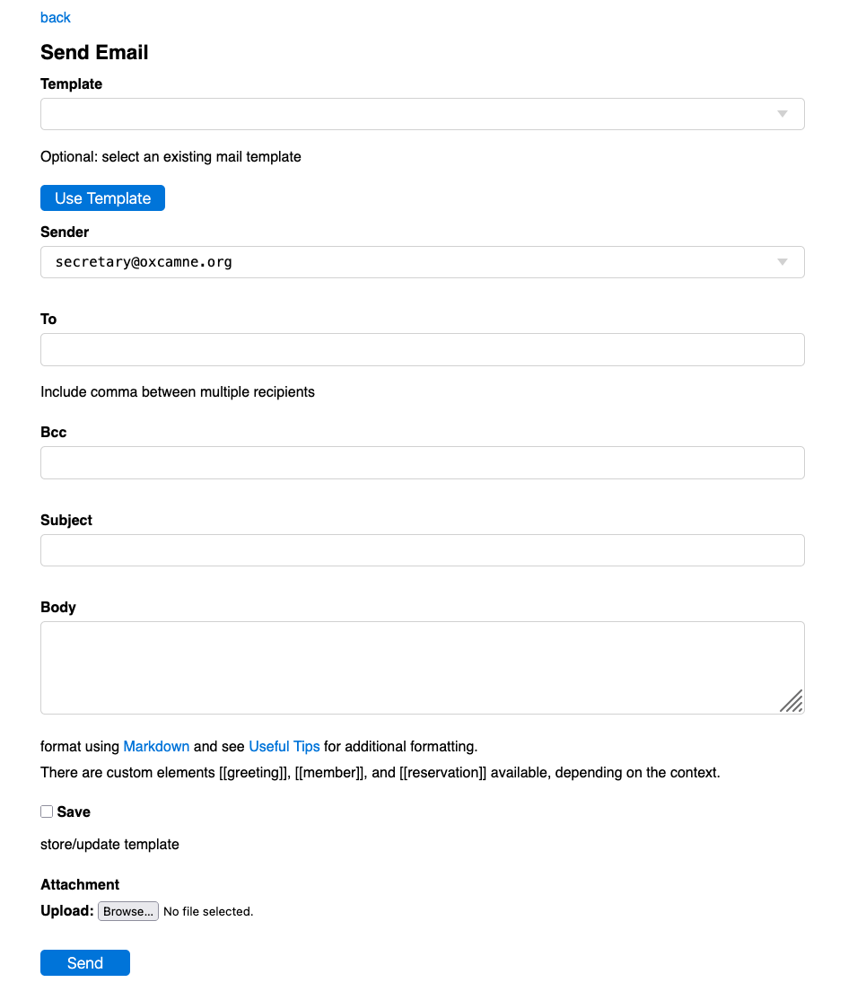

# [Oxford/Cambridge Alumni Group Database](index.md)

## Send Email Page

This screen, reached from the [member record](./member_record.md) or from a number of other contexts, is used to send an individual email or an email notice:

Members with 'write' access to the database can send email. If they have a dedicated Society email (or alias) the email will be send 'reply-to' that address. If they have multiple Society addresses they can select which should be used for 'reply-to'.

The template form at the top allows you to load a pre-prepared message, which can then be adjusted if necessary. You can save your work as a template by ticking the save box near the bottom of the form.

For an explicitly addressed message 'To:' will be a box allowing the entry of one or more email addresses separated by comma or space. If you are sending a notice to a mailing list or to any filtered list of members, it will describe the pre-selected target list.

If the message is explicitly addressed, or targetted to a single member, a 'Bcc:' box allows one or more bcc address(es) to be added. Depending on how email is set up, there may in effect be an implicit bcc to the sender, for example in OxCamNE transactional messages will appear in the sender's folder in the Society email. Mailing list messages may be sent via a service provider (Mailgun in OxCamNE's case) and will not be bcc'd.

The Sender field allows you select which address to use if you have multiple roles. Replies will be sent to this address.

The message body can use various custom tags, such as \<letterhead>,  \<greeting> which include the Society letterhead and a personalized greeting (more or less formal depending on whether the member included a title when joining).  The tag \<member> is replaced by the member's directory information or \<email> by just their email address, and in context \<reservation> will show details of a reservation.

[Markdown](https://www.markdownguide.org/basic-syntax/) can  be used to apply some formatting and to include links and graphics. The Send Email page has a link to Markdown documentation.

You can also include snippets or even large chunks of html.

See [below](send_email.md#embedding-images-in-email) for a discussion of embedding images.

You can also select a file to be sent as an attachment, such as a PDF, spreadsheet, image or word document.

Ticking the 'save/update template' box allows the content to be saved for later reuse. With a complex message such as a notice containing graphics, I often develop the message as an email to my own member record, saving as a template to make sure it looks right before sending to the mailing list. The form at the top of the screen allows a template to be loaded; the main form allows the template to be modified before it is sent.

### Embedding Images in Email

The Markdown syntax \!\[alt_text](image_url) is a simple way to include images. They are displayed as a block, i.e. text does not wrap alongside them, and at full size or, depending on the email client, scaled to occupy the available display width. Either make sure the image is not too large, or specify the display width using HTML as discussed below! Note that Markdown does not apply formatting within HTML tags.

Although Google Drive was not designed to be an image server, this can be done. You first make the image publicly available by right clicking, selecting share and then share again in the resulting menu, which produces a pop up box. If necessary, change General Access from 'Restricted' to 'Anyone with the link'. Then click Copy link followed by done. The copied link will be something like: <https://drive.google.com/file/d/1bPvuOwCA8BEwP1-s53Yc2zM1tru8rkaR/view?usp=sharing>. This includes an *image_id* `1bPvuOwCA8BEwP1-s53Yc2zM1tru8rkaR`.

You cannot use this Google Drive link directly, as it opens the image in google drive. Theoretically one should be modify the link to <https://drive.google.com/uc?export=view&id=image_id> but unfortunately at the time of writing many email clients will not display the image obtained this way (it is in SVG format). Instead modify the copied link to <https://drive.google.com/thumbnail?sz=w800&id=image_id>. Note that sz=w800 sets the resulting image width in pixels, equivalent to width="800px" in the img tag; set whatever size you want. You can use this url directly in Markdown, or if you want more complex formatting you can use html. You can set the image size (width) and make it a centered block, for example, thus:

\
\\

(If you are embedding from Google Drive, you can use the sz= parameter and don't need the width option)

Or you might wish to have the image on the left with the following text alongside, separated by a margin:

\
\\

Note the margins specified are top, right, bottom, left.

You can see other examples of html usage in recent event record Details.
