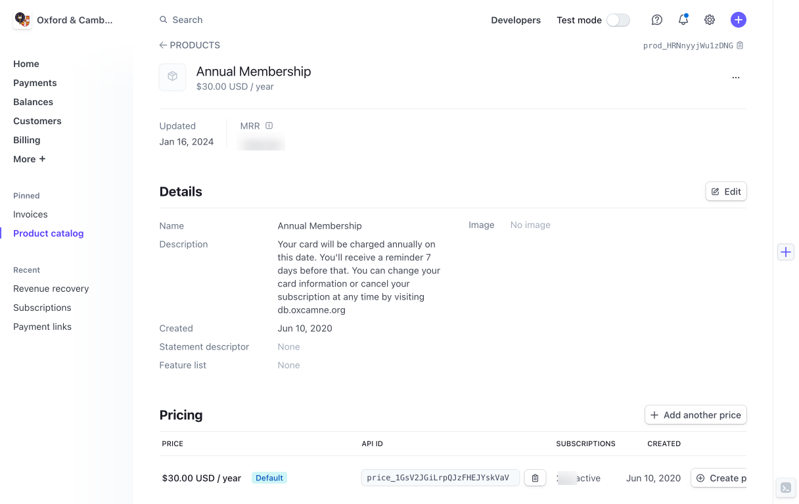

# [Oxford/Cambridge Alumni Group Database - Support Guide](support.md)

## Stripe Payment Processor

To use Stripe as payment processor, you first need to have a bank account for your organization. You can then sign up for a Stripe account, which will be linked to your bank account. On-line payments go into an Stripe hosted account. Although Stripe can be set up to automatically transfer cleared funds to the bank account, more likely one would transfer funds manually. So longs as funds remain in the Stripe account they can be used to make refunds when necessary, for example for event bookings cancelled in a timely fashion.

Stripe provides separate production and developments so that payment functions can be tested with 'play' money.

### The Payment Processor Interface

The connection between a running OxCam instance and Stripe is made based on the settings in [settings_private.py](install.md#configure-the-software-for-your-organization). All the logic implementing the payment interface is contained in the StripeProcessor class in pay_processors.py.

Implementing a different payment interface, say PayPal, would involve changing the PAYMENT_PROCESSOR setting in settings_private.py to 'paypal' and defining its keys, etc. as PAYPAL_... definitions, and creating paypal_interface.py containing paypal_... functions and controllers corresponding to the stripe_... functions in stripe_inteface.py. The payment processor used by each member is recorded in each member record, so a payment processor transition could be accomplished by leaving members with Stripe subscriptions with Stripe but implementing a different processor for others.

### The Stripe Dashboard

The Stripe Dashboard is reached by logging in to the Society's Stripe account. Upon login it's home screen is reached:

The top line has a powerful search box, into which you might put identifiers for transactions, customers, subscriptions, etc. or keywords such as 'product'. It has a live/test mode switch, and a 'developers' button through which you can access all kinds of information including the public and private API keys needed for settings_private.py.

The left side menu items most commonly used include 'payments', the 'all transactions' tab of which is used to download transactions for upload into the database; and 'balances' used to view and reconcile the Stripe balance with that shown in the database and using the 'pay out funds' button to transfer funds to the linked bank account.

I also keep the product catalog and invoices items pinned to the menu.

### Stripe Products

We use predefined products in Stripe to manage membership dues by membership category. Here is the product for full membership dues in the product catalog:

The price is defined separatly in a price record that defines both the price itself and the billing period. The sole price is marked as the default price for the product.

Should we need to change the annual cost, we would add a new price, and on its implementation date set the new price as default. The new price would be charged to new members from that point on; current subscriptions would renew at the new price at their regular renewal date (current subscriptions are switched to the new price by the daily maintenance task).

The student membership price is defined similarly, but its price is a one-time price (these members must reconfirm their student status to renew as students).

We do not define any product for event tickets, rather these products/price are defined on the fly based on event record data.

### Stripe Invoicing

Beside handling membership dues and event tickets, Stripe can also be used for general invoicing, for example if University organizations or others agree to sponsor events.

To create an invoice of this kind, go to the invoices page and click the create invoice button. You will need to find or create a customer record for the invoicee, and then a product for this particular invoice. You will see a preview of how the invoice will appear at every stage of the process.

You can allow for both ACH transfer payments and card payment, and include in the invoice a link to an online payment page in the emailed invoice.
