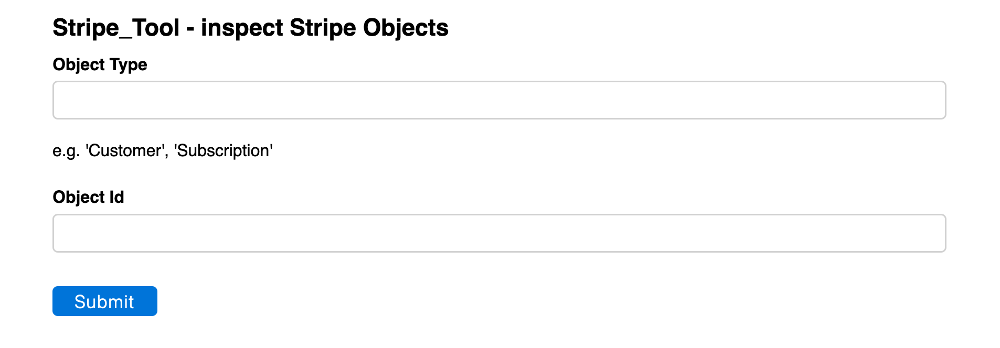

# [Oxford/Cambridge Alumni Group Database - Support Guide](support.md)

## stripe_tool

This tool allows viewing of the Stripe payment processor's database objects whose identifiers are often stored in our membership database, to be used in combination with Stripe's excellent developer documentation. It was very useful when implementing our payments interface.

To access the tool browse to \<your_py4web_url\>/oxcam/stripe_tool. The backup will be downloaded This brings up a form:

The object id would be copied from our database, e.g. from the corresponding member record. The object type must correspond to the Stripe documentation.
