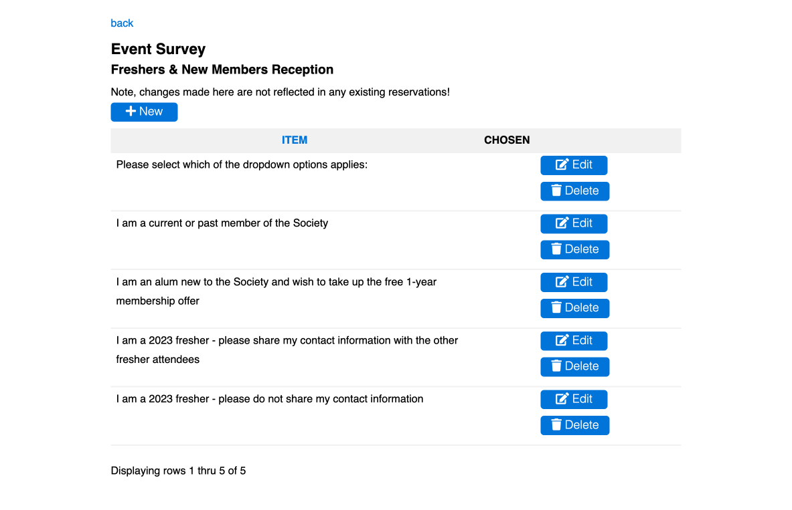

# [Oxford/Cambridge Alumni Group Application](index.md)

## Survey Page

This page is reached from the 'Survey' link at the top of the [event record](event_record.md). It can be used to create a multiple choice survey to be answered by registrants at checkout time. The example shown is from a Freshers' event.

*Note that any changes that are made on this page do not affect existing registrations!*:

The 'back' link at the top returns to the main event record.

The grid shows in the first row item column the **survey question** to be displayed in the checkout form. It should be entered first.

Subsequent rows show the alternative choices. They are shown in the order entered.

The Chosen column shows the current count of member and guest registrations making each choice.
