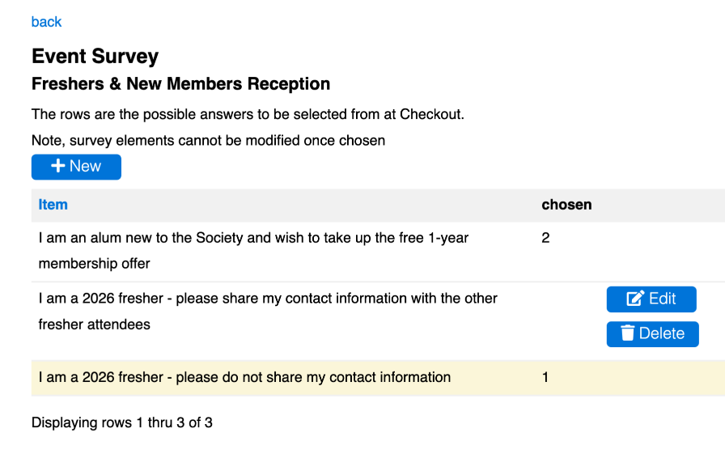
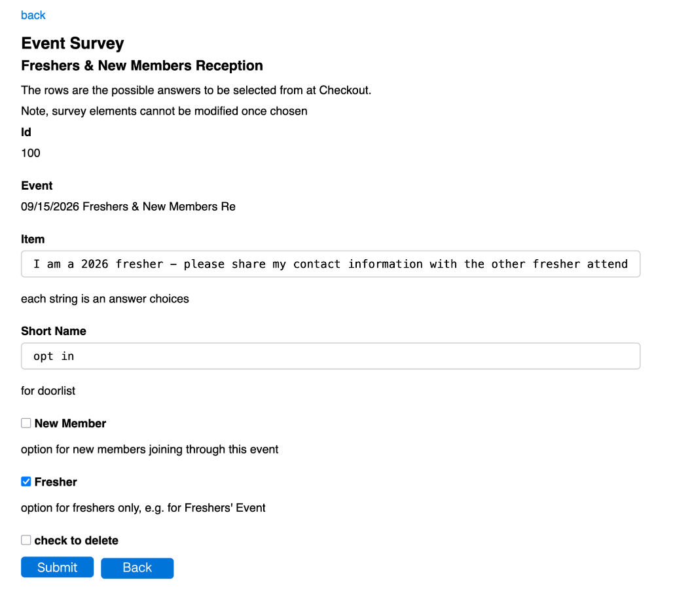

# [Oxford/Cambridge Alumni Group Application](index.md)

## Survey Page

This page is reached from the 'Survey' link at the top of the [event record](event_record.md). It can be used to create a multiple choice survey to be answered by registrants at checkout time. The example shown is from a Freshers' event.

*Note that any changes that are made on this page do not affect existing registrations!*:

The 'back' link at the top returns to the main event record.

The grid rows show the alternative user choices. They are shown in the order entered.

The Chosen column shows the current count of member and guest registrations making each choice.

Only rows that have not been chosen yet can be edited or deleted.

The survey choices are filtered based on the registrant's status as controlled by settings in the survey item:

So, in the example, the survey item is applicable only to Freshers. If there are no applicable selections, the survey is not displayed to the registrant.
