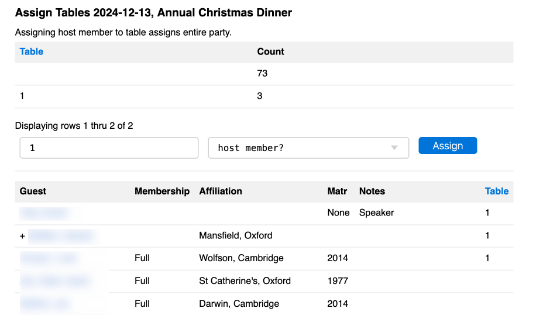

# [Oxford/Cambridge Alumni Group Application](index.md)

## Table Assigment Tool

This page is reached by clicking on an event name on the [Reservation List](reservation_list.md) and then clicking the "table assignment tool" link.

It is designed for use prior to an event such as a formal dinner.

In this example, table assignment has just begun for a Christmas dinner. The speaker and their guest, and the first other (singleton) guest have been assigned to table 1.

The top of the display shows a summary of the tables defined and the count of guest assigned to each, the first row showing the number of unassigned guests in this case.

To assign a party of member plus guests to a table, specify the table number and select the name of the host member from the dropdown in the form and click Assign.

The grid below shows all registered parties. Members' guests are shown with a '+' prefix immediately following the host member. They are sorted in reverse order by table number, then by name. Thus, the guests, so far, of the table we are assembling will tend to be shown at the top.

Clicking on a host or guest name also opens up the reservation details for that party.
