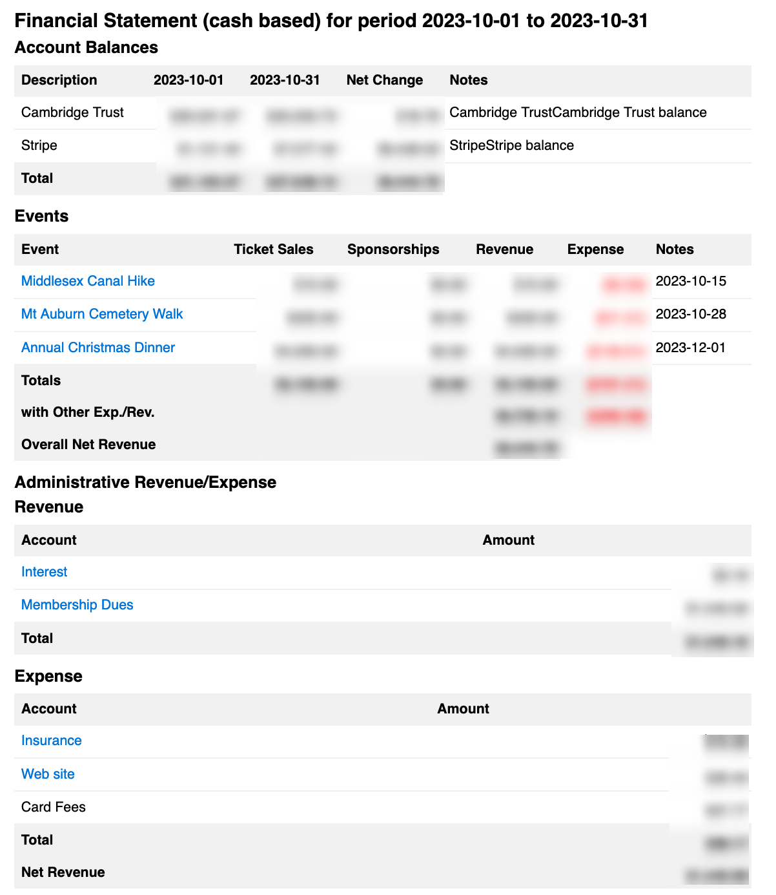

# [Oxford/Cambridge Alumni Group Application](index.md)

## Financial Statement

This page is reached from the link on the [accounts page](accounts.md) and selecting the desired date range, which would normally be a calendar year:

Unlike the Financial Statement, the Tax Statement is based strictly on the date debits or credits are booked, and excludes any accrued amounts (undeposited checks). The default period is the calendar year preceding the current date, as the tax year is the calendar year. The tax statement includes:

- Account Balances. This shows the balance for each bank or card payment processor account at the start and end of the year, together with the net change for each (and totals).

- Events. Includes an item for each event which had any expense or revenue booked during the period, regardless of the event date. For each event it shows total ticket sales, sponsorships, total revenue and total expenses. Where there are sponsorships, each is shown individually on subsequent lines, showing the individual amount and notes describing the source.

- Other Revenue. Shows all non-event based sources of revenue, listed by accounting category, with the total.

- Other Expenses. Shows all non-event based expenses, listed by accounting category, with the total.

Total Revenue and Expenses. Shows the grand total of all revenue and expense, and the net revenue for the period.
