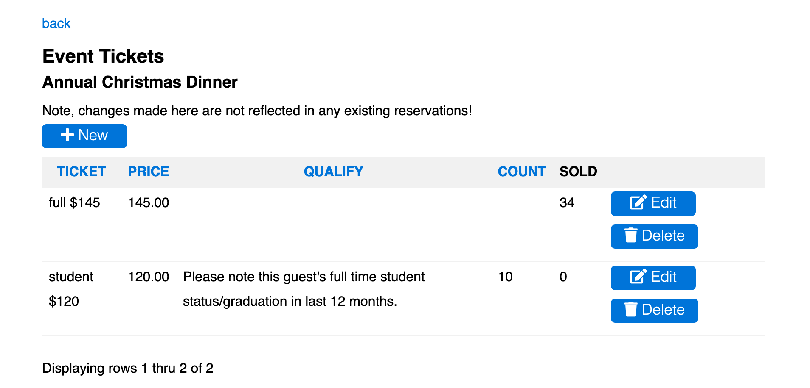
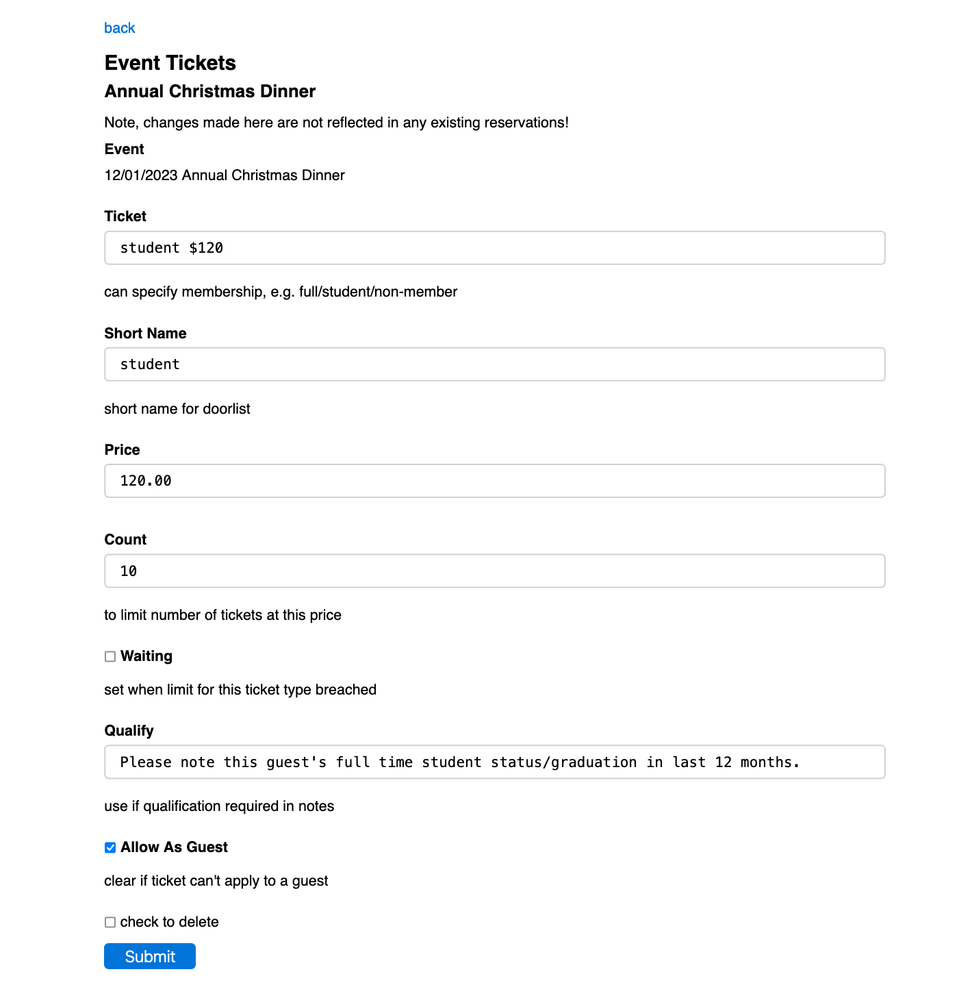

# [Oxford/Cambridge Alumni Group Database](index.md)

## Tickets Page

This page is reached from the 'Ticket Types' link at the top of the [event record](event_record.md). It is used to define ticket options for paid events.

*Note that any changes that are made on this page do not affect existing registrations!*:

The 'back' link at the top returns to the main event record.

The grid shows all ticket types defined for this event. The grid will be empty for a free event.

The **Ticket** column is the name which will appear in the registration form. This may, optionally, include the price and other information, such as the requirements to qualify for a discounted ticket. If the name begins with a membership category, then members in good standing will automatically be assigned that price. If the name begins 'non-member' then all non-members (at the time of the event) are automatically assigned the price. These automatically assigned prices are also the default for additional guests. The price here is informational and is not required.

The **Qualify** column is meaningful for discount prices. If the ticket is selected then the Notes field of the registration form must be used to document how the guest qualifies, except when the ticket type is assigned automatically. The qualify text is used as the error message otherwise.

The **Count** column may contain a number to limit the number of these tickets that can be sold, either to members or guests. Once that number have been Sold, the ticket type is no longer offered at registration.

When Edit or Display button displays the individual ticket type record:

**Price** is the numerical version of the price that is actually used.

**Short Name** (optional) replaces the ticket name in the exported .csv doorlist file for convenience.

If **Allow as Guest** is unchecked, the ticket cannot be selected for additional guests, for example Freshers attending the Freshers' event must register separately.
